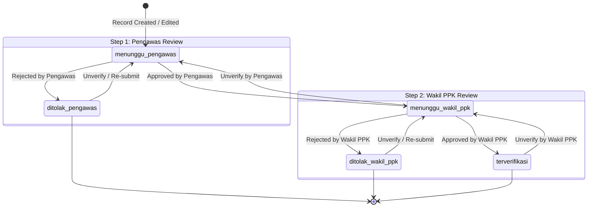

# Functional Requirements Specification — KNMP V2

This document defines the functional capabilities of the KNMP V2 platform, derived from the legacy application's implementation and business requirements.

---

## 1. Authentication & User Management

### 1.1 User Authentication
- **Actors**: All system users (Superadmin, Admin PPK, Kontraktor, Pengawas, Wakil PPK, PPK).
- **Inputs**: `email`, `password`.
- **Processing**:
  - Validates credentials against password hashes (Bcrypt / Argon2id).
  - Issues JWT access token (short-lived) + refresh token.
  - Returns user profile including assigned roles and permissions.
- **Outputs**: `{ "token": "...", "user": { "id": 1, "name": "...", "roles": [...], "permissions": [...] } }`.
- **Validation**: Required email format, non-empty password.
- **Error Cases**: `401 Unauthorized` for invalid credentials; `403 Forbidden` if account disabled.

### 1.2 User Profile & Assignment
- **Actors**: Superadmin, Admin PPK.
- **Inputs**: `name`, `email`, `password` (optional on edit), `role_id`, `knmp_ids[]` (multi-select for user assignment).
- **Processing**: Creates user, hashes password, assigns role via RBAC, and inserts linkages in `user_knmps`.
- **Outputs**: Created / updated user object with assigned KNMP locations.
- **Permissions**: `user_create`, `user_read`, `user_update`, `user_delete`.

---

## 2. Master Data & Geographic Hierarchy

### 2.1 Regional & Administrative Geo Data
- **Actors**: All authenticated users (read-only for lookups), Admin (manage).
- **Hierarchy**:
  1. `regionals` (e.g. Regional 1 Sumatera, Regional 2 Jawa, etc.)
  2. `provinces` (linked to `regional_id`)
  3. `regencies` (linked to `province_id`, type `KABUPATEN` or `KOTA`)
  4. `districts` (linked to `regency_id`)
  5. `sub_districts` (linked to `district_id`)
- **Endpoints**: Cascading select2 / dropdown API endpoints for seamless form selection.

### 2.2 KNMP Location Master
- **Actors**: Kontraktor, Superadmin, Admin PPK, Pengawas, Wakil PPK.
- **Inputs**: `regional_id`, `province_id`, `regency_id`, `district_id`, `sub_district_id`, `name`, `jenis_knmp` (`existing` | `baru`), `lat`, `long`, `status`.
- **Processing**:
  - Creates KNMP record.
  - Supports CSV/Excel batch import with geographic mapping.
  - Provides geo coordinate mapping for GIS view.
  - Aggregates overall progress and budget statistics.
- **Permissions**: `knmp_create`, `knmp_read`, `knmp_update`, `knmp_delete`.

### 2.3 Master Periode & Jenis Bangunan
- **Periode**: Annual budget/activity cycle defined by `year`, `tanggal_mulai`, `tanggal_akhir`. Permissions: `periode_create`, `periode_read`, `periode_update`, `periode_delete`.
- **Jenis Bangunan**: Infrastructure catalog with `nama`, `deskripsi`, `is_active`. Used to categorize physical progress reports. Permissions: `jenis_bangunan_create`, `jenis_bangunan_read`, `jenis_bangunan_update`, `jenis_bangunan_delete`.

---

## 3. Fase Persiapan (Preparation Phase)

### 3.1 Persiapan Kontrak
- **Actors**: Kontraktor (create/upload), Pengawas & Admin PPK (read/verify).
- **Inputs**: `knmp_id`, `nama`, `tanggal`, `keterangan`, `status`, attached documents.
- **Required Documents (11 Forms)**:
  1. `form_01_spmk` (Surat Perintah Mulai Kerja)
  2. `form_02_surat_perjanjian_kontrak` (Surat Perjanjian Kontrak)
  3. `form_03_surat_penyerahan_lapangan` (Surat Penyerahan Lapangan)
  4. `form_04_jadwal_pelaksanaan_pekerjaan` (Jadwal Pelaksanaan Pekerjaan)
  5. `form_05_jadwal_pengadaan_bahan` (Jadwal Pengadaan Bahan)
  6. `form_06_jadwal_pengadaan_peralatan` (Jadwal Pengadaan Peralatan)
  7. `form_07_jadwal_tenaga_kerja` (Jadwal Tenaga Kerja)
  8. `form_08_metode_pelaksanaan` (Metode Pelaksanaan)
  9. `form_09_organisasi_kerja` (Organisasi Kerja)
  10. `form_10_rencana_k3` (Rencana K3)
  11. `form_11_surat_permohonan_pcm` (Surat Permohonan PCM)
- **Permissions**: `kontrak_create`, `kontrak_read`, `kontrak_update`, `kontrak_delete`.

### 3.2 Pre-Construction Meeting (PCM)
- **Actors**: Kontraktor, Pengawas, Wakil PPK.
- **Inputs**: `persiapan_kontrak_id`, `nama`, `tanggal`, `keterangan`, attached documents.
- **Required Documents**:
  1. `form_12_surat_undangan_pcm` (Surat Undangan PCM)
  2. `form_13_ba_pcm` (Berita Acara PCM)

### 3.3 Persiapan Lapangan & Mobilisasi
- **Actors**: Kontraktor, Pengawas.
- **Inputs**: `knmp_id`, `nama`, `tanggal`, `keterangan`, `status`, attached documents.
- **Required Documents**:
  1. `form_13_ba_pcm` (BA PCM)
  2. `form_14_ba_mc_0` (Berita Acara Mutual Check 0% / MC-0)
  3. `form_15_laporan_mobilisasi` (Laporan Mobilisasi)
- **Permissions**: `lapangan_create`, `lapangan_read`, `lapangan_update`, `lapangan_delete`.

---

## 4. Fase Pelaksanaan (Execution & Daily Monitoring)

### 4.1 Pelaksanaan Proyek
- **Actors**: Kontraktor, Pengawas, Admin PPK, Wakil PPK.
- **Inputs**: `knmp_id`, `nama`, `tanggal`, `jenis_laporan`, `keterangan`, `status_k3`, `kendala`.
- **Milestone Progress Tracking**:
  - Milestone 1 (50%): Progress & Mutu Awal (when preliminary progress is submitted).
  - Milestone 2 (75%): Pengendalian Progress (when control docs are verified).
  - Milestone 3 (90%): Pekerjaan Kritis (advanced structural execution).
- **Permissions**: `pelaksanaan_create`, `pelaksanaan_read`, `pelaksanaan_update`, `pelaksanaan_delete`.

### 4.2 Laporan Progres Fisik (Web & Mobile)
- **Actors**: Kontraktor (submit), Pengawas (verify step 1), Wakil PPK (verify step 2).
- **Inputs**:
  - `pelaksanaan_id`, `nama`, `tanggal`, `jenis_laporan` (`harian`, `mingguan`, `bulanan`), `keberapa` (integer sequence for weekly/monthly), `cuaca` (`cerah`, `berawan`, `mendung`, `hujan`, `badai`, `lainnya`), `jumlah_tenaga_kerja`, `lat`, `long`, `keterangan`.
  - `jenis_bangunan_details[]`:
    - `jenis_bangunan_id`
    - `rencana_progres_fisik` (decimal %)
    - `realisasi_progres_fisik` (decimal %)
    - `keterangan`
    - `photos[]` (1 to 5 photos per building detail, required for mobile uploads).
- **Calculations**:
  - `deviasi = realisasi_progres_fisik - rencana_progres_fisik`.
  - Aggregate report progress = weighted or mean deviation across building details.
- **Permissions**: `laporan_create`, `laporan_read`, `laporan_update`, `laporan_delete`, `laporan_verify_pengawas`, `laporan_verify_wakil_ppk`, `laporan_unverify_pengawas`, `laporan_unverify_wakil_ppk`.

### 4.3 Absensi Tenaga Kerja & Lapangan (Mobile & Web)
- **Actors**: Kontraktor field staff.
- **Inputs**: `pelaksanaan_id`, `tipe_absensi` (`hadir` | `pulang`), `lat`, `long`, `photo` (selfie / attendance photo).
- **Processing**: Records timestamp `recorded_at`, geofence coordinates, creates document row (`category = foto_absensi`), sets verification status to `menunggu_pengawas`.
- **Permissions**: `absensi_create`, `absensi_read`, `absensi_update`, `absensi_delete`, `absensi_verify_pengawas`, `absensi_verify_wakil_ppk`.

### 4.4 Issue & Kendala Lapangan (Mobile & Web)
- **Actors**: Kontraktor, Pengawas, Wakil PPK.
- **Inputs**: `knmp_id`, `kategori_issue` (`K3`, `mutu`, `cuaca`, `material`), `tingkat` (`ringan`, `sedang`, `kritis`, `lainnya`), `uraian_masalah`, `photos[]` (1 to 5 photos).
- **Processing**: Creates issue ticket, attaches photo documents (`category = foto`), triggers notification, enters verification review pipeline.
- **Permissions**: `issue_create`, `issue_read`, `issue_update`, `issue_delete`, `issue_verify_pengawas`, `issue_verify_wakil_ppk`.

---

## 5. Two-Step Verification Workflow

- Applicable to: `Laporan`, `Absensi`, `Issue`, `Document`.
- Full audit trail stored in `verifications` table with `step`, `status`, `note`, `verified_by`, `verified_at`, `is_current`, `superseded_at`.
- Any record update automatically resets status to `menunggu_pengawas` and marks active verification logs as superseded.

---

## 6. Keuangan & Pembayaran (Disbursements)

- **Actors**: Admin PPK, Superadmin, PPK.
- **Inputs**: `persiapan_kontrak_id`, `kategori`, `name`, `termin` (installment identifier/number), `realisasi_anggaran`, `realisasi_fisik`, `norek_pekerja`.
- **Required Documents (5 Forms)**:
  1. `form_19a_bapp` (Berita Acara Pembayaran Pekerjaan)
  2. `form_23_rpd` (Rencana Penarikan Dana)
  3. `form_20_permohonan_pembayaran` (Surat Permohonan Pembayaran)
  4. `form_21_kwitansi` (Kwitansi Pembayaran)
  5. `form_22_ba_pembayaran` (Berita Acara Pembayaran)
- **Analytics & Summaries**:
  - Total contract value vs. total realized disbursement.
  - Realization percentage per termin.
  - Overall financial progress gauge.

---

## 7. Dashboard & Analytics

- **Actors**: All authorized roles (customized views per role).
- **Features**:
  - KPI summary cards (Total KNMP, Total Progress %, Total Realisasi Anggaran, Total Active Issues).
  - Progress breakdown by Regional and Province.
  - Real-time interactive GIS map showing KNMP project pins with color-coded status (Existing vs Baru, On-Track vs Delayed).
  - Recent activity feed (latest reports, issues reported, verifications awaiting action).
