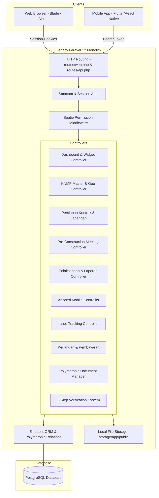

# KNMP Legacy System Analysis

## 1. Executive Summary

The legacy **KNMP** (Kampung Nelayan Maju Pertamina) application is a web and mobile backend management platform developed to monitor, coordinate, and audit infrastructure development across coastal fishing village development projects in Indonesia. It handles project preparation (contract & field mobilization), progress reporting with physical verification, daily attendance, field issue tracking, payments/financial disbursements, and GIS mapping.

---

## 2. Technology Stack Overview

| Dimension | Legacy Stack | Target V2 Stack |
| :--- | :--- | :--- |
| **Backend Framework** | PHP 8.2+ / Laravel 12.0 | Golang (Go 1.22+) / Fiber v2 (Clean Architecture) |
| **API Authentication** | Laravel Sanctum (Personal Access Tokens) | JWT (Access + Refresh tokens) |
| **Web Authentication** | Laravel Session Auth (Cookies) | Unified JWT / Bearer Token Architecture |
| **Authorization** | Spatie Laravel Permission (RBAC) | Explicit RBAC Middleware & Service Layer in Go |
| **Database** | PostgreSQL (`pgsql`) / Eloquent ORM | PostgreSQL 16 (`sqlx` + `pgx` driver, explicit SQL) |
| **DataTables / Tables** | Yajra Laravel DataTables | React TanStack Table / Server-side Pagination |
| **Frontend Framework** | Blade Templates + Alpine.js + Vite | React 18+ / TypeScript / Vite |
| **Styling** | Tailwind CSS + Sass | Tailwind CSS + Unified CSS Design Tokens |
| **File / Media Storage** | Local filesystem (`storage/app/public`) | S3 / MinIO Object Storage + Local Fallback |
| **GIS / Maps** | OpenLayers (`ol` v10.7) | Leaflet / OpenLayers React Components |
| **Queues / Jobs** | Database Queue driver (`jobs` table) | Go Asynchronous Workers / Goroutines / Background Jobs |

---

## 3. System Architecture & Component Diagram

---

## 4. Core Modules & Subsystems

1. **Identity, Authentication & Roles**:
   - Manages user accounts (`users`), project assignments (`user_knmps`), roles (`superadmin`, `admin_ppk`, `kontraktor`, `pengawas`, `wakil_ppk`, `ppk`), and granular permissions.
2. **Master & Geographical Data**:
   - Administrative hierarchy: `regionals` → `provinces` → `regencies` → `districts` → `sub_districts`.
   - `knmps` master data with coordinate points (`lat`, `long`), type (`existing` vs `baru`), and operational status.
   - `periodes` for annual budget and timeline cycles.
   - `jenis_bangunans` master for physical infrastructure categories (e.g. Kantor, Dermaga, Cold Storage, etc.).
3. **Fase Persiapan (Preparation Phase)**:
   - **Persiapan Kontrak**: Tracks contract documents (11 standard forms: SPMK, contract agreement, handover, schedule, K3 plans, PCM requests).
   - **Pre-Construction Meeting (PCM)**: Meeting records, invitations, and official reports (BA PCM).
   - **Persiapan Lapangan**: Field mobilization, MC-0, and mobilization reports.
4. **Fase Pelaksanaan (Execution & Daily Monitoring)**:
   - **Pelaksanaan**: Project milestone tracking (Milestone 1: Progress & Mutu Awal (50%), Milestone 2: Pengendalian Progress (75%), Milestone 3: Pekerjaan Kritis (90%)).
   - **Laporan Progres**: Daily, weekly, and monthly reports detailing physical work, worker count, weather conditions, planned vs. actual progress percentage, progress deviation, and photos per building type (`laporan_jenis_bangunan`).
   - **Absensi (Attendance)**: Daily check-in (`hadir`) and check-out (`pulang`) with GPS coordinates and selfie photos.
   - **Issue Management**: Field issues categorized by severity (`ringan`, `sedang`, `kritis`, `lainnya`) and category (`K3`, `mutu`, `cuaca`, `material`), complete with photo attachments.
5. **Two-Step Verification Engine**:
   - Unified verification state machine for Reports, Attendance, and Issues:
     - Step 1: `pengawas` review (`menunggu_pengawas` → `menunggu_wakil_ppk` or `ditolak_pengawas`).
     - Step 2: `wakil_ppk` review (`menunggu_wakil_ppk` → `terverifikasi` or `ditolak_wakil_ppk`).
     - Unverify capability by verifiers.
     - Auto-reset on contractor edits.
6. **Keuangan & Pembayaran (Finance & Disbursements)**:
   - Disbursement installments (`termin`), payment requests (`SPP`), receipt (`Kwitansi`), handover certificates (`BAPP`), and budget realization tracking.
7. **Polymorphic Document Management**:
   - Universal document handling (`documents` table) supporting PDF, Excel, Word, and images (`jpg`, `png`, `webp`, `heic`, `heif`), attached to any domain model with verification metadata and versioning.

---

## 5. Technical Debt & Pain Points in Legacy Application

1. **Duplicated Route Logic between Web and API**: Web controllers rely heavily on server-rendered Blade templates + Yajra DataTables, while API controllers implement separate endpoints for mobile apps, leading to diverging business logic and maintenance overhead.
2. **Polymorphic File Management & Permission Leaks**: Document download and preview endpoints lacked strict ownership and permission checking, relying only on document ID lookups.
3. **Dual State Persistence**: Form requests used inline permission checks (`$user->hasPermissionTo(...)`) while some authorization checks were scattered inside controller methods.
4. **Database Rollback Typo**: The migration `2026_06_23_033334_create_knmps_table.php` has a typo dropping `kmnps` instead of `knmps` on rollback.
5. **Tight Coupling to Laravel Magic**: Heavy reliance on Eloquent magic methods, polymorphic type strings (`App\Models\...`), and implicit session state makes scaling and standalone API clients complex.

---

## 6. Runtime & Infrastructure Requirements for V2

- **Backend Runtime**: Go 1.22+ compiled binary (Alpine Linux container friendly, minimal memory footprint ~30MB vs PHP-FPM ~200MB+).
- **Frontend Engine**: Node 20+ for building Vite bundle, served via Nginx or embedded Go static server.
- **Database**: PostgreSQL 16 with optimized connection pooling (`MaxOpenConns: 25`, `MaxIdleConns: 25`).
- **Object Storage**: S3-compatible API (MinIO for local development, AWS S3 for production).
