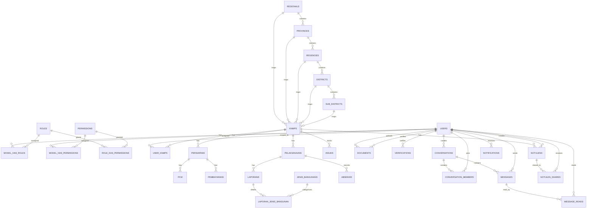

# KNMP V2 Database Architecture & Current Schema

Dokumen ini menjelaskan schema PostgreSQL yang sedang dipakai KNMP V2 berdasarkan migration aktif di `backend/migrations/` dan hasil introspeksi database lokal `knmp_db`.

Terakhir disinkronkan: 2026-08-31.

---

## 1. Ringkasan

Database KNMP V2 berpusat pada titik lokasi `knmps`, data persiapan kontrak, pelaksanaan konstruksi, laporan lapangan, dokumen, verifikasi, pembayaran, chat, notulen, notifikasi, dan master perusahaan.

Aturan akses saat ini:

- `super_admin`, `superadmin`, dan `super admin` diperlakukan sebagai Super Admin.
- Hanya Super Admin yang boleh bypass permission dan melihat seluruh titik KNMP.
- `admin_ppk` adalah role admin operasional, tetapi menu dan data tetap mengikuti direct permission di `model_has_permissions` dan assignment titik di `user_knmps`.
- User scoped yang memiliki `user_knmps` hanya melihat data titik KNMP miliknya.
- Permission menu frontend bersumber dari `permissions`, `role_has_permissions`, dan terutama direct permission `model_has_permissions` bila ada.

---

## 2. ERD Konseptual

Catatan: `documents` dan `verifications` memakai pola polymorphic melalui `documentable_type/documentable_id` dan `verifiable_type/verifiable_id`, sehingga relasi target tidak dipaksa oleh foreign key.

---

## 3. Katalog Tabel

### 3.1 Identity, RBAC, dan Scope

#### `users`

Menyimpan akun pengguna.

- `id BIGSERIAL PRIMARY KEY`
- `name VARCHAR(255) NOT NULL`
- `email VARCHAR(255) UNIQUE NOT NULL`
- `email_verified_at TIMESTAMP NULL`
- `password VARCHAR(255) NOT NULL`
- `remember_token VARCHAR(100) NULL`
- `created_at TIMESTAMP NOT NULL DEFAULT CURRENT_TIMESTAMP`
- `updated_at TIMESTAMP NOT NULL DEFAULT CURRENT_TIMESTAMP`
- `deleted_at TIMESTAMP NULL`

#### `roles`

Daftar role aplikasi.

- `id BIGSERIAL PRIMARY KEY`
- `name VARCHAR(100) UNIQUE NOT NULL`
- `guard_name VARCHAR(50) NOT NULL DEFAULT 'api'`
- `created_at TIMESTAMP NOT NULL DEFAULT CURRENT_TIMESTAMP`
- `updated_at TIMESTAMP NOT NULL DEFAULT CURRENT_TIMESTAMP`

Role penting saat ini:

- `super_admin`: Super Admin canonical baru.
- `superadmin`: role lama yang masih dikenali untuk kompatibilitas.
- `admin_ppk` / `Admin_ppk`: admin operasional.
- `pengawas`, `wakil_ppk`, `ppk`.
- `kontraktor`: role lama, tidak lagi dipakai untuk user hasil migrasi.

#### `permissions`

Daftar permission API dan menu.

- `id BIGSERIAL PRIMARY KEY`
- `name VARCHAR(100) UNIQUE NOT NULL`
- `guard_name VARCHAR(50) NOT NULL DEFAULT 'api'`
- `created_at TIMESTAMP NOT NULL DEFAULT CURRENT_TIMESTAMP`
- `updated_at TIMESTAMP NOT NULL DEFAULT CURRENT_TIMESTAMP`

Contoh permission menu:

- `dashboard`, `chat`, `knmp_read`
- `kontrak_read`, `lapangan_read`, `pelaksanaan_read`, `laporan_read`
- `anggaran_read`, `termin_read`
- `absensi_read`, `issue_read`
- `user_read`, `periode_read`, `jenis_bangunan_read`

#### `model_has_roles`

Pivot user ke role.

- `role_id BIGINT NOT NULL REFERENCES roles(id) ON DELETE CASCADE`
- `model_type VARCHAR(150) NOT NULL DEFAULT 'App\\Models\\User'`
- `model_id BIGINT NOT NULL REFERENCES users(id) ON DELETE CASCADE`
- Primary key: `(role_id, model_id, model_type)`

#### `model_has_permissions`

Direct permission per user. Bila user punya direct permission, backend memakai daftar ini sebagai permission efektif utama.

- `permission_id BIGINT NOT NULL REFERENCES permissions(id) ON DELETE CASCADE`
- `model_type VARCHAR(150) NOT NULL DEFAULT 'App\\Models\\User'`
- `model_id BIGINT NOT NULL REFERENCES users(id) ON DELETE CASCADE`
- Primary key: `(permission_id, model_id, model_type)`

#### `role_has_permissions`

Pivot role ke permission.

- `permission_id BIGINT NOT NULL REFERENCES permissions(id) ON DELETE CASCADE`
- `role_id BIGINT NOT NULL REFERENCES roles(id) ON DELETE CASCADE`
- Primary key: `(permission_id, role_id)`

#### `user_knmps`

Scope titik KNMP per user.

- `id BIGSERIAL PRIMARY KEY`
- `user_id BIGINT NOT NULL REFERENCES users(id) ON DELETE CASCADE`
- `knmp_id BIGINT NOT NULL REFERENCES knmps(id) ON DELETE CASCADE`
- `created_at TIMESTAMP NOT NULL DEFAULT CURRENT_TIMESTAMP`
- `updated_at TIMESTAMP NOT NULL DEFAULT CURRENT_TIMESTAMP`
- Unique: `(user_id, knmp_id)`

---

### 3.2 Master Wilayah dan Lokasi

#### `regionals`

- `id BIGSERIAL PRIMARY KEY`
- `name VARCHAR(255) NOT NULL`
- `created_at TIMESTAMP NOT NULL DEFAULT CURRENT_TIMESTAMP`
- `updated_at TIMESTAMP NOT NULL DEFAULT CURRENT_TIMESTAMP`

#### `provinces`

- `id BIGSERIAL PRIMARY KEY`
- `regional_id BIGINT NOT NULL REFERENCES regionals(id) ON DELETE RESTRICT`
- `name VARCHAR(255) NOT NULL`
- `created_at TIMESTAMP NOT NULL DEFAULT CURRENT_TIMESTAMP`
- `updated_at TIMESTAMP NOT NULL DEFAULT CURRENT_TIMESTAMP`

#### `regencies`

- `id BIGSERIAL PRIMARY KEY`
- `province_id BIGINT NOT NULL REFERENCES provinces(id) ON DELETE RESTRICT`
- `name VARCHAR(255) NOT NULL`
- `type VARCHAR(50) NOT NULL DEFAULT 'KABUPATEN'`
- `created_at TIMESTAMP NOT NULL DEFAULT CURRENT_TIMESTAMP`
- `updated_at TIMESTAMP NOT NULL DEFAULT CURRENT_TIMESTAMP`

#### `districts`

- `id BIGSERIAL PRIMARY KEY`
- `regency_id BIGINT NOT NULL REFERENCES regencies(id) ON DELETE RESTRICT`
- `name VARCHAR(255) NOT NULL`
- `created_at TIMESTAMP NOT NULL DEFAULT CURRENT_TIMESTAMP`
- `updated_at TIMESTAMP NOT NULL DEFAULT CURRENT_TIMESTAMP`

#### `sub_districts`

- `id BIGSERIAL PRIMARY KEY`
- `district_id BIGINT NOT NULL REFERENCES districts(id) ON DELETE RESTRICT`
- `name VARCHAR(255) NOT NULL`
- `created_at TIMESTAMP NOT NULL DEFAULT CURRENT_TIMESTAMP`
- `updated_at TIMESTAMP NOT NULL DEFAULT CURRENT_TIMESTAMP`

#### `knmps`

Master titik KNMP.

- `id BIGSERIAL PRIMARY KEY`
- `regional_id BIGINT REFERENCES regionals(id) ON DELETE SET NULL`
- `province_id BIGINT REFERENCES provinces(id) ON DELETE SET NULL`
- `regency_id BIGINT REFERENCES regencies(id) ON DELETE SET NULL`
- `district_id BIGINT REFERENCES districts(id) ON DELETE SET NULL`
- `sub_district_id BIGINT REFERENCES sub_districts(id) ON DELETE SET NULL`
- `name VARCHAR(255) NOT NULL`
- `jenis_knmp VARCHAR(50) NOT NULL DEFAULT 'existing'`
- `lat VARCHAR(50) NULL`
- `long VARCHAR(50) NULL`
- `status VARCHAR(50) NOT NULL DEFAULT 'aktif'`
- `created_at TIMESTAMP NOT NULL DEFAULT CURRENT_TIMESTAMP`
- `updated_at TIMESTAMP NOT NULL DEFAULT CURRENT_TIMESTAMP`
- `deleted_at TIMESTAMP NULL`

---

### 3.3 Master Program

#### `periodes`

- `id BIGSERIAL PRIMARY KEY`
- `year INT NOT NULL`
- `tanggal_mulai DATE NOT NULL`
- `tanggal_akhir DATE NOT NULL`
- `created_at TIMESTAMP NOT NULL DEFAULT CURRENT_TIMESTAMP`
- `updated_at TIMESTAMP NOT NULL DEFAULT CURRENT_TIMESTAMP`
- `deleted_at TIMESTAMP NULL`

#### `jenis_bangunans`

- `id BIGSERIAL PRIMARY KEY`
- `nama VARCHAR(255) NOT NULL`
- `deskripsi TEXT NULL`
- `is_active BOOLEAN NOT NULL DEFAULT TRUE`
- `created_at TIMESTAMP NOT NULL DEFAULT CURRENT_TIMESTAMP`
- `updated_at TIMESTAMP NOT NULL DEFAULT CURRENT_TIMESTAMP`
- `deleted_at TIMESTAMP NULL`

#### `perusahaans`

Master perusahaan penyedia/kontraktor.

- `id BIGSERIAL PRIMARY KEY`
- `nama VARCHAR(255) NOT NULL`
- `alamat TEXT NULL`
- `npwp VARCHAR(100) NULL`
- `nama_direktur VARCHAR(255) NULL`
- `jabatan_direktur VARCHAR(100) NULL DEFAULT 'Direktur'`
- `no_telp VARCHAR(50) NULL`
- `email VARCHAR(255) NULL`
- `notaris_akta VARCHAR(255) NULL`
- `tanggal_akta VARCHAR(50) NULL`
- `no_akta VARCHAR(100) NULL`
- `nama_bank VARCHAR(100) NULL`
- `norek_bank VARCHAR(100) NULL`
- `cabang_bank VARCHAR(255) NULL`
- `nama_bank_jaminan VARCHAR(100) NULL`
- `no_jaminan VARCHAR(100) NULL`
- `tgl_jaminan VARCHAR(50) NULL`
- `no_kontrak VARCHAR(255) NULL`
- `nama_paket TEXT NULL`
- `status_administrasi VARCHAR(100) NULL`
- `status_karwas VARCHAR(100) NULL`
- `created_at TIMESTAMP NOT NULL DEFAULT CURRENT_TIMESTAMP`
- `updated_at TIMESTAMP NOT NULL DEFAULT CURRENT_TIMESTAMP`
- `deleted_at TIMESTAMP NULL`

---

### 3.4 Persiapan dan PCM

#### `persiapans`

Menyimpan data persiapan kontrak dan persiapan lapangan.

- `id BIGSERIAL PRIMARY KEY`
- `knmp_id BIGINT NULL REFERENCES knmps(id) ON DELETE CASCADE`
- `user_id BIGINT NULL REFERENCES users(id) ON DELETE SET NULL`
- `nama VARCHAR(255) NOT NULL`
- `tanggal DATE NOT NULL`
- `jenis VARCHAR(50) NOT NULL`
- `keterangan TEXT NULL`
- `status VARCHAR(50) NULL`
- `additional_data JSONB NULL`
- `created_by BIGINT NULL REFERENCES users(id) ON DELETE SET NULL`
- `updated_by BIGINT NULL REFERENCES users(id) ON DELETE SET NULL`
- `created_at TIMESTAMP NOT NULL DEFAULT CURRENT_TIMESTAMP`
- `updated_at TIMESTAMP NOT NULL DEFAULT CURRENT_TIMESTAMP`
- `deleted_at TIMESTAMP NULL`

Nilai umum `jenis`: `kontrak`, `lapangan`.

#### `pcm`

- `id BIGSERIAL PRIMARY KEY`
- `persiapan_kontrak_id BIGINT NOT NULL REFERENCES persiapans(id) ON DELETE CASCADE`
- `nama VARCHAR(255) NOT NULL`
- `tanggal DATE NOT NULL`
- `keterangan TEXT NULL`
- `created_at TIMESTAMP NOT NULL DEFAULT CURRENT_TIMESTAMP`
- `updated_at TIMESTAMP NOT NULL DEFAULT CURRENT_TIMESTAMP`
- `deleted_at TIMESTAMP NULL`

---

### 3.5 Pelaksanaan, Laporan, Absensi, dan Issue

#### `pelaksanaans`

- `id BIGSERIAL PRIMARY KEY`
- `knmp_id BIGINT NULL REFERENCES knmps(id) ON DELETE CASCADE`
- `user_id BIGINT NULL REFERENCES users(id) ON DELETE SET NULL`
- `nama VARCHAR(255) NOT NULL`
- `tanggal DATE NOT NULL`
- `jenis_laporan VARCHAR(50) NULL`
- `status_k3 VARCHAR(50) NULL`
- `kendala TEXT NULL`
- `keterangan TEXT NULL`
- `additional_data JSONB NULL`
- `created_by BIGINT NULL REFERENCES users(id) ON DELETE SET NULL`
- `updated_by BIGINT NULL REFERENCES users(id) ON DELETE SET NULL`
- `created_at TIMESTAMP NOT NULL DEFAULT CURRENT_TIMESTAMP`
- `updated_at TIMESTAMP NOT NULL DEFAULT CURRENT_TIMESTAMP`
- `deleted_at TIMESTAMP NULL`

#### `laporans`

- `id BIGSERIAL PRIMARY KEY`
- `pelaksanaan_id BIGINT NOT NULL REFERENCES pelaksanaans(id) ON DELETE CASCADE`
- `user_id BIGINT NULL REFERENCES users(id) ON DELETE SET NULL`
- `nama VARCHAR(255) NOT NULL`
- `tanggal DATE NOT NULL`
- `jenis_laporan VARCHAR(50) NOT NULL DEFAULT 'harian'`
- `keberapa INT NULL`
- `cuaca VARCHAR(50) NULL`
- `jumlah_tenaga_kerja INT NOT NULL DEFAULT 0`
- `rencana_progres_fisik NUMERIC(8,2) NOT NULL DEFAULT 0.00`
- `realisasi_progres_fisik NUMERIC(8,2) NOT NULL DEFAULT 0.00`
- `status VARCHAR(50) NOT NULL DEFAULT 'menunggu_pengawas'`
- `lat VARCHAR(50) NULL`
- `long VARCHAR(50) NULL`
- `keterangan TEXT NULL`
- `additional_data JSONB NULL`
- `created_by BIGINT NULL REFERENCES users(id) ON DELETE SET NULL`
- `updated_by BIGINT NULL REFERENCES users(id) ON DELETE SET NULL`
- `created_at TIMESTAMP NOT NULL DEFAULT CURRENT_TIMESTAMP`
- `updated_at TIMESTAMP NOT NULL DEFAULT CURRENT_TIMESTAMP`
- `deleted_at TIMESTAMP NULL`

Sumber widget tenaga kerja dashboard:

- `total_workers`: `SUM(laporans.jumlah_tenaga_kerja)`
- `today_workers`: `SUM(laporans.jumlah_tenaga_kerja)` untuk `laporans.tanggal >= CURRENT_DATE - INTERVAL '7 days'`
- Keduanya ikut filter `pelaksanaans.knmp_id` bila user memiliki scope `user_knmps`.

#### `laporan_jenis_bangunan`

- `id BIGSERIAL PRIMARY KEY`
- `laporan_id BIGINT NOT NULL REFERENCES laporans(id) ON DELETE CASCADE`
- `jenis_bangunan_id BIGINT NOT NULL REFERENCES jenis_bangunans(id) ON DELETE RESTRICT`
- `rencana_progres_fisik NUMERIC(8,2) NOT NULL DEFAULT 0.00`
- `realisasi_progres_fisik NUMERIC(8,2) NOT NULL DEFAULT 0.00`
- `keterangan TEXT NULL`
- `created_at TIMESTAMP NOT NULL DEFAULT CURRENT_TIMESTAMP`
- `updated_at TIMESTAMP NOT NULL DEFAULT CURRENT_TIMESTAMP`
- `deleted_at TIMESTAMP NULL`

#### `absensis`

- `id BIGSERIAL PRIMARY KEY`
- `pelaksanaan_id BIGINT NOT NULL REFERENCES pelaksanaans(id) ON DELETE CASCADE`
- `user_id BIGINT NULL REFERENCES users(id) ON DELETE SET NULL`
- `tipe_absensi VARCHAR(50) NOT NULL`
- `recorded_at TIMESTAMP NOT NULL DEFAULT CURRENT_TIMESTAMP`
- `lat VARCHAR(50) NULL`
- `long VARCHAR(50) NULL`
- `status VARCHAR(50) NOT NULL DEFAULT 'menunggu_pengawas'`
- `created_by BIGINT NULL REFERENCES users(id) ON DELETE SET NULL`
- `updated_by BIGINT NULL REFERENCES users(id) ON DELETE SET NULL`
- `created_at TIMESTAMP NOT NULL DEFAULT CURRENT_TIMESTAMP`
- `updated_at TIMESTAMP NOT NULL DEFAULT CURRENT_TIMESTAMP`
- `deleted_at TIMESTAMP NULL`

Nilai umum `tipe_absensi`: `hadir`, `pulang`.

#### `issues`

- `id BIGSERIAL PRIMARY KEY`
- `knmp_id BIGINT NOT NULL REFERENCES knmps(id) ON DELETE CASCADE`
- `kategori_issue VARCHAR(50) NOT NULL`
- `tingkat VARCHAR(50) NOT NULL`
- `status VARCHAR(50) NOT NULL DEFAULT 'menunggu_pengawas'`
- `uraian_masalah TEXT NOT NULL`
- `created_by BIGINT NULL REFERENCES users(id) ON DELETE SET NULL`
- `created_at TIMESTAMP NOT NULL DEFAULT CURRENT_TIMESTAMP`
- `updated_at TIMESTAMP NOT NULL DEFAULT CURRENT_TIMESTAMP`
- `deleted_at TIMESTAMP NULL`

---

### 3.6 Pembayaran

#### `pembayarans`

- `id BIGSERIAL PRIMARY KEY`
- `persiapan_kontrak_id BIGINT NOT NULL REFERENCES persiapans(id) ON DELETE CASCADE`
- `kategori VARCHAR(100) NULL`
- `name VARCHAR(255) NOT NULL`
- `termin VARCHAR(50) NOT NULL`
- `realisasi_anggaran NUMERIC(15,2) NOT NULL DEFAULT 0.00`
- `realisasi_fisik NUMERIC(8,2) NOT NULL DEFAULT 0.00`
- `norek_pekerja VARCHAR(100) NULL`
- `created_at TIMESTAMP NOT NULL DEFAULT CURRENT_TIMESTAMP`
- `updated_at TIMESTAMP NOT NULL DEFAULT CURRENT_TIMESTAMP`
- `deleted_at TIMESTAMP NULL`

Nilai umum `termin`: `Termin 1`, `Termin 2`, `Termin 3`, `Termin 4`, `Retensi`.

---

### 3.7 Dokumen dan Verifikasi

#### `documents`

- `id BIGSERIAL PRIMARY KEY`
- `documentable_type VARCHAR(150) NOT NULL`
- `documentable_id BIGINT NOT NULL`
- `file_name VARCHAR(255) NOT NULL`
- `file_path VARCHAR(500) NOT NULL`
- `file_type VARCHAR(100) NULL`
- `category VARCHAR(100) NOT NULL`
- `version VARCHAR(20) NOT NULL DEFAULT '1.0'`
- `status VARCHAR(50) NOT NULL DEFAULT 'pending'`
- `note TEXT NULL`
- `uploaded_at TIMESTAMP NOT NULL DEFAULT CURRENT_TIMESTAMP`
- `verified_at TIMESTAMP NULL`
- `uploaded_by BIGINT NULL REFERENCES users(id) ON DELETE SET NULL`
- `verified_by BIGINT NULL REFERENCES users(id) ON DELETE SET NULL`
- `created_at TIMESTAMP NOT NULL DEFAULT CURRENT_TIMESTAMP`
- `updated_at TIMESTAMP NOT NULL DEFAULT CURRENT_TIMESTAMP`
- `deleted_at TIMESTAMP NULL`

Nilai umum `documentable_type`: `knmp`, `persiapan`, `pcm`, `pelaksanaan`, `laporan_jenis_bangunan`, `absensi`, `issue`, `pembayaran`.

#### `verifications`

- `id BIGSERIAL PRIMARY KEY`
- `verifiable_type VARCHAR(150) NOT NULL`
- `verifiable_id BIGINT NOT NULL`
- `step VARCHAR(50) NOT NULL`
- `status VARCHAR(50) NOT NULL`
- `note TEXT NULL`
- `verified_by BIGINT NULL REFERENCES users(id) ON DELETE SET NULL`
- `verified_at TIMESTAMP NOT NULL DEFAULT CURRENT_TIMESTAMP`
- `is_current BOOLEAN NOT NULL DEFAULT TRUE`
- `superseded_at TIMESTAMP NULL`
- `created_at TIMESTAMP NOT NULL DEFAULT CURRENT_TIMESTAMP`
- `updated_at TIMESTAMP NOT NULL DEFAULT CURRENT_TIMESTAMP`
- `deleted_at TIMESTAMP NULL`

Nilai umum:

- `verifiable_type`: `laporan`, `absensi`, `issue`, `document`
- `step`: `pengawas`, `wakil_ppk`
- `status`: `pending`, `approved`, `rejected`, `unverified`

---

### 3.8 Chat

#### `conversations`

- `id BIGSERIAL PRIMARY KEY`
- `type VARCHAR(20) NOT NULL DEFAULT 'personal'`
- `name VARCHAR(255) NULL`
- `description TEXT NULL`
- `avatar_url VARCHAR(500) NULL`
- `created_by BIGINT NULL REFERENCES users(id) ON DELETE SET NULL`
- `last_message_id BIGINT NULL`
- `last_message_at TIMESTAMPTZ NOT NULL DEFAULT NOW()`
- `created_at TIMESTAMPTZ NOT NULL DEFAULT NOW()`
- `updated_at TIMESTAMPTZ NOT NULL DEFAULT NOW()`
- `deleted_at TIMESTAMP NULL`

#### `conversation_members`

- `id BIGSERIAL PRIMARY KEY`
- `conversation_id BIGINT NOT NULL REFERENCES conversations(id) ON DELETE CASCADE`
- `user_id BIGINT NOT NULL REFERENCES users(id) ON DELETE CASCADE`
- `role VARCHAR(20) NOT NULL DEFAULT 'member'`
- `last_read_message_id BIGINT NULL`
- `joined_at TIMESTAMPTZ NOT NULL DEFAULT NOW()`
- `created_at TIMESTAMPTZ NOT NULL DEFAULT NOW()`
- `updated_at TIMESTAMPTZ NOT NULL DEFAULT NOW()`
- Unique: `(conversation_id, user_id)`

#### `messages`

- `id BIGSERIAL PRIMARY KEY`
- `conversation_id BIGINT NOT NULL REFERENCES conversations(id) ON DELETE CASCADE`
- `sender_id BIGINT NOT NULL REFERENCES users(id) ON DELETE CASCADE`
- `message_type VARCHAR(20) NOT NULL DEFAULT 'text'`
- `content TEXT NOT NULL`
- `attachment_url VARCHAR(500) NULL`
- `attachment_name VARCHAR(255) NULL`
- `attachment_size BIGINT NULL`
- `created_at TIMESTAMPTZ NOT NULL DEFAULT NOW()`
- `updated_at TIMESTAMPTZ NOT NULL DEFAULT NOW()`
- `deleted_at TIMESTAMP NULL`

#### `message_reads`

- `id BIGSERIAL PRIMARY KEY`
- `message_id BIGINT NOT NULL REFERENCES messages(id) ON DELETE CASCADE`
- `user_id BIGINT NOT NULL REFERENCES users(id) ON DELETE CASCADE`
- `read_at TIMESTAMPTZ NOT NULL DEFAULT NOW()`
- Unique: `(message_id, user_id)`

---

### 3.9 Notulen

#### `notulens`

- `id BIGSERIAL PRIMARY KEY`
- `knmp_id BIGINT NULL REFERENCES knmps(id) ON DELETE SET NULL`
- `judul VARCHAR(255) NOT NULL`
- `tanggal DATE NOT NULL DEFAULT CURRENT_DATE`
- `waktu_mulai VARCHAR(20) NULL`
- `waktu_selesai VARCHAR(20) NULL`
- `lokasi VARCHAR(255) NULL`
- `pimpinan_rapat VARCHAR(255) NULL`
- `notulis VARCHAR(255) NULL DEFAULT 'Super Admin'`
- `agenda TEXT NULL`
- `hasil_pembahasan TEXT NOT NULL`
- `tindak_lanjut TEXT NULL`
- `status VARCHAR(20) NULL DEFAULT 'published'`
- `created_by BIGINT NULL REFERENCES users(id) ON DELETE SET NULL`
- `created_at TIMESTAMPTZ NULL DEFAULT NOW()`
- `updated_at TIMESTAMPTZ NULL DEFAULT NOW()`
- `deleted_at TIMESTAMPTZ NULL`

#### `notulen_shares`

- `id BIGSERIAL PRIMARY KEY`
- `notulen_id BIGINT NOT NULL REFERENCES notulens(id) ON DELETE CASCADE`
- `user_id BIGINT NOT NULL REFERENCES users(id) ON DELETE CASCADE`
- `access_type VARCHAR(20) DEFAULT 'viewer'`
- `shared_at TIMESTAMPTZ NULL DEFAULT NOW()`
- Unique: `(notulen_id, user_id)`

Nilai umum `access_type`: `viewer`, `editor`.

---

### 3.10 Notifications dan Migration Tracking

#### `notifications`

- `id BIGSERIAL PRIMARY KEY`
- `user_id BIGINT NULL REFERENCES users(id) ON DELETE CASCADE`
- `role_target VARCHAR(100) NULL`
- `title VARCHAR(255) NOT NULL`
- `message TEXT NOT NULL`
- `category VARCHAR(50) NOT NULL`
- `type VARCHAR(20) NOT NULL DEFAULT 'info'`
- `link VARCHAR(500) NULL`
- `is_read BOOLEAN NOT NULL DEFAULT FALSE`
- `read_at TIMESTAMPTZ NULL`
- `created_at TIMESTAMPTZ NULL DEFAULT NOW()`
- `updated_at TIMESTAMPTZ NULL DEFAULT NOW()`
- `deleted_at TIMESTAMPTZ NULL`

#### `schema_migrations`

- `version VARCHAR(255) PRIMARY KEY`
- `applied_at TIMESTAMPTZ NULL DEFAULT NOW()`

---

## 4. Soft Delete

Sebagian besar tabel domain memakai `deleted_at` dan query aplikasi umumnya memfilter `deleted_at IS NULL`.

Tabel dengan `deleted_at`:

- `users`, `knmps`, `periodes`, `jenis_bangunans`
- `persiapans`, `pcm`, `pelaksanaans`, `laporans`, `laporan_jenis_bangunan`
- `absensis`, `issues`, `pembayarans`
- `documents`, `verifications`
- `conversations`, `messages`
- `notulens`, `notifications`, `perusahaans`

Pivot table seperti `model_has_roles`, `model_has_permissions`, `role_has_permissions`, `user_knmps`, `conversation_members`, `message_reads`, dan `notulen_shares` tidak memakai soft delete.

---

## 5. Index dan Constraint Penting

Index utama:

- `idx_users_email` pada `users(email)`
- `idx_knmps_regional` pada `knmps(regional_id)`
- `idx_knmps_province` pada `knmps(province_id)`
- `idx_user_knmps_user` pada `user_knmps(user_id)`
- `idx_user_knmps_knmp` pada `user_knmps(knmp_id)`
- `idx_persiapans_knmp` pada `persiapans(knmp_id)`
- `idx_persiapans_jenis` pada `persiapans(jenis)`
- `idx_pcm_persiapan_kontrak` pada `pcm(persiapan_kontrak_id)`
- `idx_pelaksanaans_knmp` pada `pelaksanaans(knmp_id)`
- `idx_laporans_pelaksanaan` pada `laporans(pelaksanaan_id)`
- `idx_laporan_jb_laporan` pada `laporan_jenis_bangunan(laporan_id)`
- `idx_absensis_pelaksanaan` pada `absensis(pelaksanaan_id)`
- `idx_issues_knmp` pada `issues(knmp_id)`
- `idx_pembayarans_persiapan_kontrak` pada `pembayarans(persiapan_kontrak_id)`
- `idx_documents_polymorphic` pada `documents(documentable_type, documentable_id)`
- `idx_documents_category` pada `documents(category)`
- `idx_verifications_polymorphic` pada `verifications(verifiable_type, verifiable_id)`
- `idx_verifications_current` pada `verifications(is_current)`
- `idx_notifications_user_id`, `idx_notifications_role_target`, `idx_notifications_is_read`, `idx_notifications_created_at`
- `idx_conversations_last_msg_at`, `idx_conv_members_user_id`, `idx_conv_members_conv_id`, `idx_messages_conv_id_created`, `idx_messages_sender_id`, `idx_message_reads_user`
- `idx_notulens_knmp_id`, `idx_notulens_created_by`, `idx_notulen_shares_user_id`
- `idx_perusahaans_nama`, `idx_perusahaans_kontrak`, `idx_perusahaans_status_admin`

Unique/primary constraints penting:

- `users.email` unique
- `roles.name` unique
- `permissions.name` unique
- `user_knmps(user_id, knmp_id)` unique
- `model_has_roles(role_id, model_id, model_type)` primary key
- `model_has_permissions(permission_id, model_id, model_type)` primary key
- `role_has_permissions(permission_id, role_id)` primary key
- `conversation_members(conversation_id, user_id)` unique
- `message_reads(message_id, user_id)` unique
- `notulen_shares(notulen_id, user_id)` unique

---

## 6. Seed dan Data Operasional

Seed utama:

- `backend/migrations/000001_init_all_schema_and_seeds.up.sql`: schema awal, seed lokasi, contoh persiapan/pelaksanaan/laporan, chat table, role/permission awal, soft delete columns, dan permission grants.
- `backend/migrations/000003_create_perusahaans_table.up.sql`: master perusahaan penyedia/kontraktor.
- `backend/migrations/000004_create_notulens_table.up.sql`: notulen dan share.
- `backend/migrations/000005_add_access_type_to_notulen_shares.up.sql`: `access_type` notulen share.
- `backend/migrations/000006_migrate_kontraktor_users_to_admin_and_add_super_admin.up.sql`: membuat role `super_admin`, assign `superadmin@gmail.com`, dan memigrasikan user role `kontraktor` ke `Admin_ppk`.
- `backend/migrations/000007_scope_admin_permissions_for_assigned_knmp_users.up.sql`: memberi direct permission terbatas untuk admin scoped yang punya assignment `user_knmps`.
- `backend/migrations/seed_sumatera_knmps.sql`: data lokasi KNMP Sumatera.
- `backend/migrations/seed_kontrak_sumatera.sql`: data kontrak Sumatera.

Seeder runtime:

- `backend/internal/repository/postgres/migrate.go`
- `backend/db/seed/seed.go`

Seeder runtime memastikan:

- role dan permission dasar tersedia;
- user default tersedia;
- setiap titik KNMP memiliki user pelaksana/admin scoped;
- kontrak Sumatera dan milestone pembayaran tersedia bila belum ada.

---

## 7. Query Dashboard Penting

Endpoint dashboard memakai repository `backend/internal/repository/postgres/knmp_repo.go`.

Sumber data utama:

- Total lokasi: `COUNT(*) FROM knmps WHERE deleted_at IS NULL`
- Status lokasi: `knmps.status`
- Total pelaksanaan: `COUNT(*) FROM pelaksanaans WHERE deleted_at IS NULL`
- Jumlah tenaga kerja: `SUM(laporans.jumlah_tenaga_kerja)` melalui join `laporans -> pelaksanaans`
- Tenaga kerja hari ini: saat ini memakai jendela 7 hari terakhir, bukan tanggal hari ini murni
- Total issue: `COUNT(*) FROM issues WHERE deleted_at IS NULL`
- Finance summary: gabungan `persiapans`, `pembayarans`, dan `knmps`

Untuk user non-Super Admin, handler mengirim `userKnmpIDs` dari JWT ke query repository, sehingga `knmps`, widget, laporan, persiapan, dan pelaksanaan dibatasi ke titik yang ada di `user_knmps`.

---

## 8. Catatan Kompatibilitas

- Nama role lama masih dapat muncul dalam seed atau environment lama: `superadmin`, `SuperAdmin`, `Admin_ppk`, `Kontraktor`.
- Kode backend melakukan normalisasi case-insensitive saat assign role.
- Role canonical untuk Super Admin baru adalah `super_admin`.
- User admin scoped sebaiknya selalu memiliki:
  - satu atau lebih baris di `user_knmps`;
  - direct permission di `model_has_permissions`;
  - tidak mengandalkan permission role global untuk menentukan menu.
