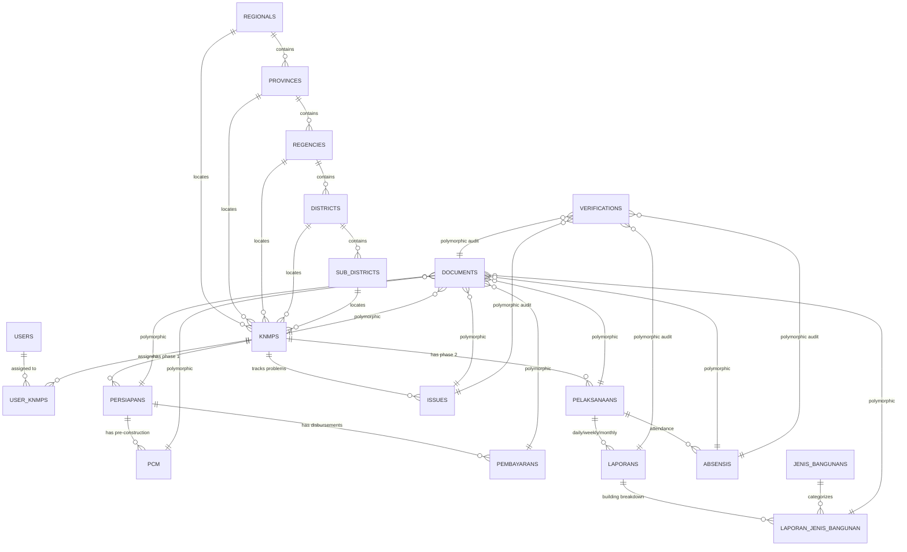

# Legacy Database Architecture & Schema Specification

This document details the complete PostgreSQL schema of the legacy KNMP system and defines the target PostgreSQL mapping for KNMP V2.

---

## 1. Conceptual Entity Relationship Diagram (ERD)

---

## 2. Comprehensive Schema Table Catalog

### 2.1 Core Identity & Access Tables
1. **`users`**
   - `id`: `BIGSERIAL PRIMARY KEY`
   - `name`: `VARCHAR(255) NOT NULL`
   - `email`: `VARCHAR(255) UNIQUE NOT NULL`
   - `email_verified_at`: `TIMESTAMP NULL`
   - `password`: `VARCHAR(255) NOT NULL`
   - `remember_token`: `VARCHAR(100) NULL`
   - `created_at`, `updated_at`: `TIMESTAMP NULL`

2. **`roles` & `permissions`** (Spatie RBAC Tables)
   - `roles`: `id`, `name`, `guard_name`, `created_at`, `updated_at`
   - `permissions`: `id`, `name`, `guard_name`, `created_at`, `updated_at`
   - `model_has_roles`: `role_id`, `model_type`, `model_id`
   - `model_has_permissions`: `permission_id`, `model_type`, `model_id`
   - `role_has_permissions`: `permission_id`, `role_id`

3. **`user_knmps`**
   - `id`: `BIGSERIAL PRIMARY KEY`
   - `user_id`: `BIGINT NOT NULL REFERENCES users(id) ON DELETE CASCADE`
   - `knmp_id`: `BIGINT NOT NULL REFERENCES knmps(id) ON DELETE CASCADE`
   - `created_at`, `updated_at`: `TIMESTAMP NULL`

---

### 2.2 Geographic Master Data Tables
4. **`regionals`**: `id`, `name`, `timestamps`
5. **`provinces`**: `id`, `regional_id REFERENCES regionals(id)`, `name`, `timestamps`
6. **`regencies`**: `id`, `province_id REFERENCES provinces(id)`, `name`, `type` (`KABUPATEN` | `KOTA`), `timestamps`
7. **`districts`**: `id`, `regency_id REFERENCES regencies(id)`, `name`, `timestamps`
8. **`sub_districts`**: `id`, `district_id REFERENCES districts(id)`, `name`, `timestamps`

---

### 2.3 Master Planning & Facilities
9. **`knmps`**
   - `id`: `BIGSERIAL PRIMARY KEY`
   - `regional_id`: `BIGINT REFERENCES regionals(id)`
   - `province_id`: `BIGINT REFERENCES provinces(id)`
   - `regency_id`: `BIGINT REFERENCES regencies(id)`
   - `district_id`: `BIGINT REFERENCES districts(id)`
   - `sub_district_id`: `BIGINT REFERENCES sub_districts(id)`
   - `name`: `VARCHAR(255) NOT NULL`
   - `jenis_knmp`: `VARCHAR(50) DEFAULT 'existing'` (`existing` | `baru`)
   - `lat`: `VARCHAR(50) NULL`
   - `long`: `VARCHAR(50) NULL`
   - `status`: `VARCHAR(50) DEFAULT 'aktif'`
   - `created_at`, `updated_at`: `TIMESTAMP NULL`

10. **`periodes`**
    - `id`: `BIGSERIAL PRIMARY KEY`
    - `year`: `INT NOT NULL`
    - `tanggal_mulai`: `DATE NOT NULL`
    - `tanggal_akhir`: `DATE NOT NULL`
    - `created_at`, `updated_at`: `TIMESTAMP NULL`

11. **`jenis_bangunans`**
    - `id`: `BIGSERIAL PRIMARY KEY`
    - `nama`: `VARCHAR(255) NOT NULL`
    - `deskripsi`: `TEXT NULL`
    - `is_active`: `BOOLEAN DEFAULT TRUE`
    - `created_at`, `updated_at`: `TIMESTAMP NULL`

---

### 2.4 Preparation Phase Tables
12. **`persiapans`**
    - `id`: `BIGSERIAL PRIMARY KEY`
    - `knmp_id`: `BIGINT REFERENCES knmps(id) ON DELETE CASCADE`
    - `user_id`: `BIGINT REFERENCES users(id)`
    - `nama`: `VARCHAR(255) NOT NULL`
    - `tanggal`: `DATE NOT NULL`
    - `jenis`: `VARCHAR(50) NOT NULL` (`kontrak` | `lapangan`)
    - `keterangan`: `TEXT NULL`
    - `status`: `VARCHAR(50) NULL`
    - `additional_data`: `JSONB NULL`
    - `created_by`: `BIGINT REFERENCES users(id)`
    - `updated_by`: `BIGINT REFERENCES users(id)`
    - `created_at`, `updated_at`, `deleted_at`: `TIMESTAMP NULL`

13. **`pcm`**
    - `id`: `BIGSERIAL PRIMARY KEY`
    - `persiapan_kontrak_id`: `BIGINT REFERENCES persiapans(id) ON DELETE CASCADE`
    - `nama`: `VARCHAR(255) NOT NULL`
    - `tanggal`: `DATE NOT NULL`
    - `keterangan`: `TEXT NULL`
    - `created_at`, `updated_at`: `TIMESTAMP NULL`

---

### 2.5 Execution & Daily Monitoring Tables
14. **`pelaksanaans`**
    - `id`: `BIGSERIAL PRIMARY KEY`
    - `knmp_id`: `BIGINT REFERENCES knmps(id) ON DELETE CASCADE`
    - `user_id`: `BIGINT REFERENCES users(id)`
    - `nama`: `VARCHAR(255) NOT NULL`
    - `tanggal`: `DATE NOT NULL`
    - `jenis_laporan`: `VARCHAR(50) NULL`
    - `status_k3`: `VARCHAR(50) NULL`
    - `kendala`: `TEXT NULL`
    - `keterangan`: `TEXT NULL`
    - `additional_data`: `JSONB NULL`
    - `created_by`: `BIGINT REFERENCES users(id)`
    - `updated_by`: `BIGINT REFERENCES users(id)`
    - `created_at`, `updated_at`: `TIMESTAMP NULL`

15. **`laporans`**
    - `id`: `BIGSERIAL PRIMARY KEY`
    - `pelaksanaan_id`: `BIGINT REFERENCES pelaksanaans(id) ON DELETE CASCADE`
    - `user_id`: `BIGINT REFERENCES users(id)`
    - `nama`: `VARCHAR(255) NOT NULL`
    - `tanggal`: `DATE NOT NULL`
    - `jenis_laporan`: `VARCHAR(50) NOT NULL` (`harian`, `mingguan`, `bulanan`)
    - `keberapa`: `INT NULL`
    - `cuaca`: `VARCHAR(50) NULL` (`cerah`, `berawan`, `mendung`, `hujan`, `badai`, `lainnya`)
    - `jumlah_tenaga_kerja`: `INT DEFAULT 0`
    - `rencana_progres_fisik`: `DECIMAL(8,2) DEFAULT 0.00`
    - `realisasi_progres_fisik`: `DECIMAL(8,2) DEFAULT 0.00`
    - `status`: `VARCHAR(50) DEFAULT 'menunggu_pengawas'`
    - `lat`: `VARCHAR(50) NULL`
    - `long`: `VARCHAR(50) NULL`
    - `keterangan`: `TEXT NULL`
    - `additional_data`: `JSONB NULL`
    - `created_by`: `BIGINT REFERENCES users(id)`
    - `updated_by`: `BIGINT REFERENCES users(id)`
    - `created_at`, `updated_at`: `TIMESTAMP NULL`

16. **`laporan_jenis_bangunan`**
    - `id`: `BIGSERIAL PRIMARY KEY`
    - `laporan_id`: `BIGINT REFERENCES laporans(id) ON DELETE CASCADE`
    - `jenis_bangunan_id`: `BIGINT REFERENCES jenis_bangunans(id)`
    - `rencana_progres_fisik`: `DECIMAL(8,2) DEFAULT 0.00`
    - `realisasi_progres_fisik`: `DECIMAL(8,2) DEFAULT 0.00`
    - `keterangan`: `TEXT NULL`
    - `created_at`, `updated_at`: `TIMESTAMP NULL`

17. **`absensis`**
    - `id`: `BIGSERIAL PRIMARY KEY`
    - `pelaksanaan_id`: `BIGINT REFERENCES pelaksanaans(id) ON DELETE CASCADE`
    - `user_id`: `BIGINT REFERENCES users(id)`
    - `tipe_absensi`: `VARCHAR(50) NOT NULL` (`hadir` | `pulang`)
    - `recorded_at`: `TIMESTAMP NOT NULL DEFAULT CURRENT_TIMESTAMP`
    - `lat`: `VARCHAR(50) NULL`
    - `long`: `VARCHAR(50) NULL`
    - `status`: `VARCHAR(50) DEFAULT 'menunggu_pengawas'`
    - `created_by`: `BIGINT REFERENCES users(id)`
    - `updated_by`: `BIGINT REFERENCES users(id)`
    - `created_at`, `updated_at`: `TIMESTAMP NULL`

18. **`issues`**
    - `id`: `BIGSERIAL PRIMARY KEY`
    - `knmp_id`: `BIGINT REFERENCES knmps(id) ON DELETE CASCADE`
    - `kategori_issue`: `VARCHAR(50) NOT NULL` (`K3`, `mutu`, `cuaca`, `material`)
    - `tingkat`: `VARCHAR(50) NOT NULL` (`ringan`, `sedang`, `kritis`, `lainnya`)
    - `status`: `VARCHAR(50) DEFAULT 'menunggu_pengawas'`
    - `uraian_masalah`: `TEXT NOT NULL`
    - `created_by`: `BIGINT REFERENCES users(id)`
    - `created_at`, `updated_at`: `TIMESTAMP NULL`

---

### 2.6 Financial & Disbursement Tables
19. **`pembayarans`**
    - `id`: `BIGSERIAL PRIMARY KEY`
    - `persiapan_kontrak_id`: `BIGINT REFERENCES persiapans(id) ON DELETE CASCADE`
    - `kategori`: `VARCHAR(100) NULL`
    - `name`: `VARCHAR(255) NOT NULL`
    - `termin`: `VARCHAR(50) NOT NULL`
    - `realisasi_anggaran`: `DECIMAL(15,2) DEFAULT 0.00`
    - `realisasi_fisik`: `DECIMAL(8,2) DEFAULT 0.00`
    - `norek_pekerja`: `VARCHAR(100) NULL`
    - `created_at`, `updated_at`: `TIMESTAMP NULL`

---

### 2.7 Universal Polymorphic Documents & Verifications
20. **`documents`**
    - `id`: `BIGSERIAL PRIMARY KEY`
    - `documentable_type`: `VARCHAR(150) NOT NULL` (e.g. `knmp`, `persiapan`, `pcm`, `pelaksanaan`, `laporan_jenis_bangunan`, `absensi`, `issue`, `pembayaran`)
    - `documentable_id`: `BIGINT NOT NULL`
    - `file_name`: `VARCHAR(255) NOT NULL`
    - `file_path`: `VARCHAR(500) NOT NULL`
    - `file_type`: `VARCHAR(100) NULL`
    - `category`: `VARCHAR(100) NOT NULL`
    - `version`: `VARCHAR(20) DEFAULT '1.0'`
    - `status`: `VARCHAR(50) DEFAULT 'pending'` (`pending`, `verified`, `rejected`)
    - `note`: `TEXT NULL`
    - `uploaded_at`: `TIMESTAMP NOT NULL DEFAULT CURRENT_TIMESTAMP`
    - `verified_at`: `TIMESTAMP NULL`
    - `uploaded_by`: `BIGINT REFERENCES users(id)`
    - `verified_by`: `BIGINT REFERENCES users(id)`
    - `created_at`, `updated_at`: `TIMESTAMP NULL`

21. **`verifications`**
    - `id`: `BIGSERIAL PRIMARY KEY`
    - `verifiable_type`: `VARCHAR(150) NOT NULL` (e.g. `laporan`, `absensi`, `issue`, `document`)
    - `verifiable_id`: `BIGINT NOT NULL`
    - `step`: `VARCHAR(50) NOT NULL` (`pengawas` | `wakil_ppk`)
    - `status`: `VARCHAR(50) NOT NULL` (`pending`, `approved`, `rejected`, `unverified`)
    - `note`: `TEXT NULL`
    - `verified_by`: `BIGINT REFERENCES users(id)`
    - `verified_at`: `TIMESTAMP NOT NULL DEFAULT CURRENT_TIMESTAMP`
    - `is_current`: `BOOLEAN DEFAULT TRUE`
    - `superseded_at`: `TIMESTAMP NULL`
    - `created_at`, `updated_at`: `TIMESTAMP NULL`
