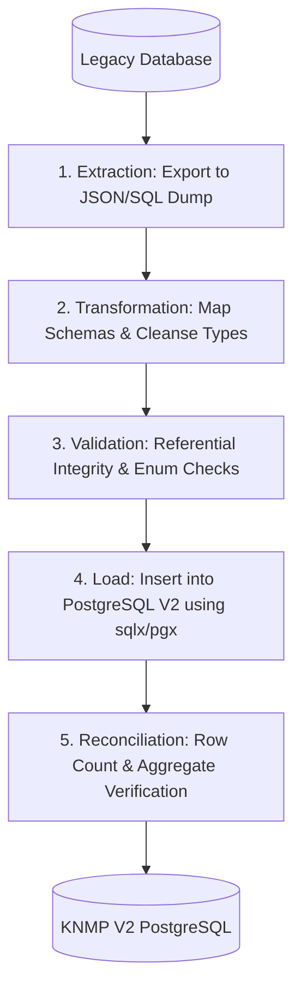

# Migration Plan & Data Reconciliation Strategy — KNMP V2

This document defines the repeatable data extraction, transformation, validation, and reconciliation strategy for migrating data from legacy KNMP to KNMP V2.

---

## 1. Migration Sequence & Pipeline

---

## 2. Table-by-Table Mapping & Transformation

| Legacy Table | Target PostgreSQL Table | Transformation / Notes |
| :--- | :--- | :--- |
| `users` | `users` | Passwords preserved as Bcrypt hashes; email uniqueness enforced. |
| `roles` & `permissions` | `roles`, `permissions`, `user_roles`, `role_permissions` | Normalized RBAC structure in Go backend. |
| `regionals`, `provinces`, `regencies`, `districts`, `sub_districts` | Same | Preserved exactly with hierarchical foreign keys. |
| `knmps` | `knmps` | Corrected rollback typo in migration; preserved coordinates and `jenis_knmp`. |
| `user_knmps` | `user_knmps` | Direct mapping of user-to-location assignments. |
| `persiapans` | `persiapans` | Preserved discriminator `jenis` (`kontrak` vs `lapangan`) and soft deletes. |
| `pcm` | `pcm` | Direct mapping linked to `persiapan_kontrak_id`. |
| `pelaksanaans` | `pelaksanaans` | Preserved execution phase headers. |
| `laporans` | `laporans` | Preserved progress metrics, weather, workers, coordinates, and status. |
| `laporan_jenis_bangunan` | `laporan_jenis_bangunan` | Direct mapping linking reports with building catalog progress. |
| `absensis` | `absensis` | Preserved timestamps, GPS coordinates, and attendance type. |
| `issues` | `issues` | Preserved issue categories, severity levels, and problem descriptions. |
| `pembayarans` | `pembayarans` | Preserved termin installments, budget realization, and bank accounts. |
| `documents` | `documents` | Polymorphic `documentable_type` simplified to canonical identifiers (`persiapan`, `pelaksanaan`, `laporan_jenis_bangunan`, `absensi`, `issue`, `pembayaran`). |
| `verifications` | `verifications` | Preserved two-step verification audit trail with `step`, `status`, and `is_current`. |

---

## 3. Data Cleansing & Validation Rules

1. **Null / Default Handling**:
   - Numeric progress percentages (`rencana_progres_fisik`, `realisasi_progres_fisik`) default to `0.00` if null.
   - Statuses defaulting to `menunggu_pengawas` if empty.
2. **Polymorphic Type Normalization**:
   - Legacy PHP classes like `App\Models\Pelaksanaan\Pelaksanaan` or `App\Models\LaporanJenisBangunan` are transformed into clean strings `pelaksanaan`, `laporan_jenis_bangunan`, `absensi`, `issue`, `persiapan`.
3. **File Path Normalization**:
   - File paths pointing to local disk paths `/storage/documents/...` are cataloged and mapped to the target object storage structure.

---

## 4. Reconciliation & Verification Checklist

- [ ] **Row Count Match**: `COUNT(*)` legacy = `COUNT(*)` target for all core entities.
- [ ] **Referential Integrity**: 100% of foreign keys resolve without orphaned records.
- [ ] **Financial Totals**: Sum of `realisasi_anggaran` in `pembayarans` matches exactly.
- [ ] **Status Consistency**: Count of approved/rejected verifications equals matching status counts in `laporans`, `absensis`, and `issues`.
