# Panduan Teknis & Kamus Sumber Data: Template Laporan Mingguan PPK KNMP

> **Program Kampung Nelayan Merah Putih (KNMP) – Wilayah Sumatra**  
> Standar Format Pelaporan Resmi Pejabat Pembuat Komitmen (PPK) KKP & Pertamina TA 2026.

Dokumen ini menjelaskan struktur arsitektur, silsilah data (*data lineage*), formula perhitungan, dan keterkaitan tabel database PostgreSQL untuk setiap seksi (**Bagian A s.d. Bagian M**) pada **Template Laporan Mingguan PPK**.

---

## 1. Diagram Alir Sumber Data (*Data Flow Architecture*)

```mermaid
flowchart TD
    subgraph Database_PostgreSQL ["PostgreSQL Database Tables"]
        T_USERS["users (Role PPK / Pejabat)"]
        T_KNMPS["knmps (346 Titik Lokasi & Koordinat GIS)"]
        T_PERSIAPAN["persiapans (Pagu Kontrak & Perusahaan)"]
        T_PELAKSANAAN["pelaksanaans (Log Harian, Cuaca, K3)"]
        T_LAPORAN["laporans & laporan_jenis_bangunan (Progres Fisik & Klaster)"]
        T_PEMBAYARAN["pembayarans (Realisasi Keuangan & Termin)"]
        T_ISSUES["issues (Kendala Lapangan & Mitigasi)"]
        T_DOCUMENTS["documents (Foto Geotagging GPS & Notulen)"]
    end

    subgraph Report_Sections ["Template Laporan Mingguan PPK (A - M)"]
        SEC_A["A. Identitas Laporan"]
        SEC_B["B. Ringkasan Eksekutif (Auto Narrative)"]
        SEC_C["C. Dashboard Capaian Mingguan (KPI Cards & Gauges)"]
        SEC_D["D. Peta Sebaran Titik Sumatra (Spasial GIS)"]
        SEC_E["E. Capaian Progress Fisik (Rekap Tahapan)"]
        SEC_F["F. Rekap Lokasi (346 Titik KNMP)"]
        SEC_G["G. Progress Per Klaster Pekerjaan (5 Klaster)"]
        SEC_H["H. Isu / Kendala Minggu Ini (Risk Level R/M/T)"]
        SEC_I["I. Solusi & Rencana Tindak Lanjut"]
        SEC_J["J. Rencana Pekerjaan Minggu Depan"]
        SEC_K["K. Dokumentasi Geotagging (6 Sampel Klaster)"]
        SEC_L["L. Kepatuhan & Keselamatan Kerja (K3 / HSE)"]
        SEC_M["M. Penutup & Lembar Pengesahan Resmi"]
    end

    T_USERS --> SEC_A & SEC_M
    T_KNMPS --> SEC_A & SEC_D & SEC_F
    T_PERSIAPAN --> SEC_A & SEC_C
    T_LAPORAN --> SEC_B & SEC_C & SEC_E & SEC_G & SEC_J
    T_PEMBAYARAN --> SEC_C
    T_ISSUES --> SEC_B & SEC_H & SEC_I
    T_PELAKSANAAN --> SEC_E & SEC_J & SEC_L
    T_DOCUMENTS --> SEC_K
```

---

## 2. Rincian Sumber Data Seksi per Seksi (Bagian A – M)

### 📌 Bagian A: Identitas Laporan
Bagian ini memuat atribut dasar administratif penyelenggaraan proyek KNMP se-Sumatera.

| Field / Parameter | Sumber Data Database | Keterangan & Aturan Bisnis |
| :--- | :--- | :--- |
| **PPK** | `users.name` (role: `ppk` / `admin_ppk`) | Nama lengkap dan gelar Pejabat Pembuat Komitmen resmi. |
| **Wilayah** | Master data wilayah regional (`regionals.nama`) | Tetap: **SUMATRA** (meliputi seluruh provinsi di Pulau Sumatera). |
| **Jumlah Lokasi (Titik KNMP)** | `COUNT(*) FROM knmps` | Total **346 Titik Nelayan** se-Sumatera. |
| **Jumlah Kontraktor Pelaksana** | `COUNT(DISTINCT perusahaan_id) FROM persiapans` | Jumlah badan usaha/penyedia jasa konstruksi yang aktif terkontrak. |
| **Sumber Pendanaan** | Master Kontrak (`persiapans.sumber_dana`) | Default: **APBN** (Kementerian Kelautan dan Perikanan). |
| **Tahun Anggaran** | `persiapans.tahun_anggaran` | Tahun Anggaran berjalan: **2026**. |
| **Tanggal Laporan** | Timestamp pembuatan / batas cut-off mingguan | Tanggal akhir periode minggu pelaporan. |

---

### 📌 Bagian B: Ringkasan Eksekutif (*Executive Summary*)
Narasi cerdas yang dihasilkan otomatis (*automated dynamic briefing*) dari rangkuman capaian minggu berjalan.

* **Logika Pembuatan Teks Narasi**:
  $$\text{Teks} = f(\text{Capaian Fisik Rata-rata}, N_{\text{on\_progress}}, N_{\text{selesai}}, N_{\text{persiapan}}, N_{\text{isu\_kritis}})$$
* **Template Paragraf**:
  > *"Pada minggu ini, pelaksanaan Program KNMP Sumatra menunjukkan kemajuan positif dengan capaian fisik kumulatif sebesar **[Capaian Fisik]%**. Sebanyak **[Jumlah On Progress]** lokasi on progress, **[Jumlah Selesai]** lokasi selesai, dan **[Jumlah Persiapan]** lokasi masih dalam tahap persiapan. Terdapat **[Jumlah Isu]** isu/kendala utama yang sedang ditindaklanjuti dengan solusi dan rencana aksi yang terencana. Secara umum, pelaksanaan proyek berjalan sesuai rencana dengan komitmen untuk menjaga kualitas, keselamatan, dan ketepatan waktu."*

---

### 📌 Bagian C: Dashboard Capaian Mingguan
Visualisasi metrik KPI utama kinerja fisik dan keuangan.

| Metrik KPI | Formula & Query Sumber Data | Target / Basis |
| :--- | :--- | :--- |
| **Capaian Fisik Kumulatif** | $\frac{1}{N} \sum_{i=1}^{N} \text{realisasi\_progres\_fisik}_i$ dari tabel `laporans` | Target: **100%** (Rata-rata tertimbang seluruh titik) |
| **Lokasi On Progress** | `COUNT(*) FROM knmps WHERE status_progres = 'on_progress'` | Jumlah titik nelayan dalam tahap konstruksi aktif |
| **Lokasi Selesai** | `COUNT(*) FROM knmps WHERE realisasi_progres >= 100` | Jumlah titik yang telah selesai 100% dan siap PHO |
| **Nilai Kontrak Kumulatif** | $\sum \text{nilai\_kontrak}$ dari tabel `persiapans` | Pagu agregat 346 titik (Rp 127.450.000.000) |
| **Realisasi Keuangan Kumulatif** | $\sum \text{realisasi\_anggaran}$ dari tabel `pembayarans` | Total pencairan termin (Rp & %) |
| **Sisa Anggaran** | $\text{Nilai Kontrak Kumulatif} - \text{Realisasi Keuangan}$ | Sisa pagu dana yang belum dicairkan (Rp & %) |

---

### 📌 Bagian D: Peta Sebaran Titik KNMP Sumatra
Peta spasial interaktif sebaran 346 titik nelayan di seluruh pulau Sumatera dengan sistem pewarnaan status:

* **🟢 Hijau (Selesai)**: Progres fisik telah mencapai 100% / siap serah terima.
* **🔵 Biru (On Progress)**: Pekerjaan fisik di lapangan sedang berjalan aktif.
* **🟡 Kuning (Dalam Persiapan)**: Tahap PCM, mobilisasi alat/bahan, atau perijinan.
* **🔴 Merah (Tertunda / Bermasalah)**: Terjadi kendala kritis (cuaca ekstrem/sengketa lahan).
* **Sumber Data**: Kolom `latitude`, `longitude`, `status_progres` pada tabel `knmps`.

---

### 📌 Bagian E: Capaian Progress Fisik (Rekap Tahapan Pelaksanaan Konstruksi)
Tabel matriks evaluasi progres mingguan berdasarkan tahapan dokumen dan fisik modul Pelaksanaan Konstruksi:

1. **Dokumen Progress & Mutu Awal (Tahap 1 - 50%)**: Form 01–11 (Progress Fisik, Mutu Awal, Pekerjaan Kritis Awal, Material, Peralatan, Tenaga Kerja, K3, Jadwal, Admin, Deviasi).
2. **Dokumen Pengendalian Progress (Tahap 2 - 75%)**: Form 12–22 (Pengendalian Progress Fisik, Mutu Pekerjaan, Pekerjaan Kritis, Volume Pekerjaan, Risiko & Deviasi).
3. **Dokumen Pekerjaan Kritis (Tahap 3 - 90%)**: Form 23–33 (Item Utama, Potensi Keterlambatan, Material & Peralatan, K3, Administrasi Akhir).
4. **Administrasi & Perijinan Lapangan**: Sempadan Pantai & Izin Pelabuhan/Tambat.
5. **QC / Pengendalian Mutu**: Uji kuat tekan beton & kepatuhan spesifikasi teknis.
6. **Lain-lain / Sarana Pendukung**: Paving block, drainase, IPAL & fasilitas nelayan.

* **Sumber Data**: Rekapitulasi perbandingan $\text{Minggu Lalu} \rightarrow \text{Minggu Ini} \rightarrow \text{Kumulatif}$ dari tabel `pelaksanaans`, `documents`, dan `laporans`.

---

### 📌 Bagian F: Rekap Lokasi (Titik KNMP)
Tabel agregat status distribusi dari total 346 lokasi nelayan:

$$\text{Persentase Status (\%)} = \frac{\text{Jumlah Lokasi Status Tertentu}}{346} \times 100\%$$

* **Total Lokasi**: Wajib bernilai **346 Titik** (100.0%).
* **Sumber Data**: Agregasi status pada tabel master `knmps`.

---

### 📌 Bagian G: Progress Per Klaster Pekerjaan
Horizontal progress indicators untuk 5 klaster komponen program KNMP:

| Klaster | Cakupan Jenis Bangunan | Sumber Data Tabel |
| :--- | :--- | :--- |
| 🏢 **A. Infrastruktur Darat** | Tempat Pelelangan Ikan (TPI), jalan akses sentra, kantor pengelola, pos jaga | `laporan_jenis_bangunan` JOIN `jenis_bangunans` |
| ⛵ **B. Infrastruktur Laut** | Dermaga tambat labuh, breakwater (pemecah gelombang), revetment pantai | `laporan_jenis_bangunan` JOIN `jenis_bangunans` |
| ⚙️ **C. Sarana Produksi** | Pabrik es mini (ice maker), cold storage, instalasi solar cell, pompa BBM nelayan | `laporan_jenis_bangunan` JOIN `jenis_bangunans` |
| 🏪 **D. Sarana Pendukung & UMKM** | Kios kuliner pesisir, sentra pengolahan hasil laut, IPAL komunal, toilet umum | `laporan_jenis_bangunan` JOIN `jenis_bangunans` |
| 👥 **E. Penguatan Sosial** | Balai pertemuan nelayan, papan informasi digital, sarana pelatihan K3 nelayan | `laporan_jenis_bangunan` JOIN `jenis_bangunans` |

---

### 📌 Bagian H: Isu / Kendala Minggu Ini
Tabel identifikasi kendala lapangan yang sedang terjadi:

* **Kolom**: `No`, `Isu/Kendala`, `Lokasi Terdampak`, `Dampak`, `Penyebab`, `Tingkat Risiko`.
* **Klasifikasi Risiko**:
  * 🔴 **R (Risiko Tinggi)**: Menghambat jalur kritis (*critical path*) atau menunda jadwal > 7 hari.
  * 🟡 **M (Risiko Menengah)**: Keterlambatan parsial material yang masih memiliki *float time*.
  * 🟢 **T (Risiko Rendah)**: Kendala administratif minor.
* **Sumber Data**: Tabel `issues` (`deskripsi_kendala`, `dampak`, `penyebab`, `tingkat_kendala`).

---

### 📌 Bagian I: Solusi dan Rencana Tindak Lanjut
Tabel rencana aksi mitigasi kendala:

* **Kolom**: `No`, `Solusi / Rencana Aksi`, `PIC (Person in Charge)`, `Target Penyelesaian`, `Status`.
* **Status Action Items**: `On Progress` | `Dalam Proses` | `Selesai`.
* **Sumber Data**: Kolom `rencana_mitigasi`, `pic`, `target_selesai`, `status` dari tabel `issues` serta butir kesepakatan tindak lanjut dari tabel `notulens`.

---

### 📌 Bagian J: Rencana Pekerjaan Minggu Depan
Target capaian kerja untuk 7 hari kalender berikutnya:

* **Kolom**: `No`, `Rencana Pekerjaan Utama`, `Target Capaian (%)`.
* **Sumber Data**: Field `rencana_minggu_depan` pada tabel `pelaksanaans` dan `laporans`.

---

### 📌 Bagian K: Dokumentasi Kegiatan Minggu Ini (Sampel Geotagging)
Galeri 6 foto sampel representatif yang mewakili setiap rumpun kegiatan di lapangan:
1. *Pekerjaan Infrastruktur Darat*
2. *Pekerjaan Infrastruktur Laut*
3. *Sarana & Prasarana Produksi*
4. *Sarana Pendukung & UMKM*
5. *Pengadaan & Distribusi Alat*
6. *Rapat Koordinasi Lapangan / Pre-Construction Meeting*

* **Sumber Data**: Tabel `documents` (`documentable_type = 'pelaksanaan' OR 'laporan'`) dengan metadata koordinat GPS (*geotagging*).

---

### 📌 Bagian L: Kepatuhan & Keselamatan Kerja (K3 / HSE)
Indikator kinerja keselamatan dan kesehatan kerja konstruksi:

* ⚠️ **Kecelakaan Kerja (Lost Time Injury)**: `0 Kejadian`
* ⚠️ **Near Miss (Hampir Celaka)**: `0 Kejadian`
* 👷 **Pelatihan / Toolbox Meeting K3**: `[N] Kegiatan`
* 🛡️ **Tingkat Kepatuhan APD**: `[N]%`
* **Sumber Data**: Log keselamatan kerja harian pada tabel `pelaksanaans` dan dokumen lampiran K3.

---

### 📌 Bagian M: Penutup & Lembar Pengesahan Resmi
Bagian otentikasi dokumen laporan mingguan resmi yang memuat tanda tangan:
1. **Pejabat Pembuat Komitmen (PPK) KNMP SUMATRA**
2. **Kepala Dinas Kelautan dan Perikanan Provinsi**

* **Footer Resmi**:
  * *Catatan Waktu*: Wajib disampaikan setiap hari Senin maksimal pukul 10.00 WIB.
  * *Slogan Program*: *"Bersinergi Membangun Desa Pesisir, Ekonomi Naik, Nelayan Sejahtera"*.
  * *Versi Dokumen*: `Versi 1.0 – 2026`.

---

## 3. Matriks Silsilah Data (*Data Lineage Matrix*)

| Seksi Template | Nama Bagian | Tabel PostgreSQL Utama | Endpoint API Backend |
| :---: | :--- | :--- | :--- |
| **A** | Identitas Laporan | `users`, `knmps`, `persiapans` | `GET /api/v1/knmp/summary` |
| **B** | Ringkasan Eksekutif | Generator Otomatis berbasis `laporans` | `GET /api/v1/laporan/project-report` |
| **C** | Dashboard Capaian | `laporans`, `pembayarans`, `persiapans` | `GET /api/v1/knmp/widget` |
| **D** | Peta Sebaran GIS | `knmps` (`lat`, `long`, `status_progres`) | `GET /api/v1/knmp/gis` |
| **E** | Capaian Progres Rekap | `pelaksanaans`, `laporan_jenis_bangunan` | `GET /api/v1/laporan` |
| **F** | Rekap Lokasi 346 Titik | `knmps` | `GET /api/v1/knmp` |
| **G** | Progress Klaster | `laporan_jenis_bangunan`, `jenis_bangunans` | `GET /api/v1/laporan/project-report` |
| **H** | Isu / Kendala | `issues` | `GET /api/v1/issues` |
| **I** | Solusi & Tindak Lanjut | `issues`, `notulens` | `GET /api/v1/issues`, `GET /api/v1/notulen` |
| **J** | Rencana Minggu Depan | `pelaksanaans`, `laporans` | `GET /api/v1/pelaksanaan` |
| **K** | Foto Geotagging | `documents` | `GET /api/v1/documents` |
| **L** | Kepatuhan K3 (HSE) | `pelaksanaans` | `GET /api/v1/pelaksanaan` |
| **M** | Lembar Pengesahan | Profil Pejabat (`users`) | `GET /api/v1/users/profile` |

---

## 4. Panduan Penggunaan pada Antarmuka Aplikasi

1. **Membuka Template**:
   - Navigasi ke menu **Laporan** pada Sidebar.
   - Klik tombol **"Template Laporan Mingguan PPK"** pada header action bar.
2. **Navigasi Tab Dual-Mode**:
   - **Dokumen Laporan Mingguan**: Tampilan siap cetak (*Print Ready*) format A3/A4 Landscape.
   - **Silsilah & Sumber Data (A - M)**: Panduan transparansi formula dan asal tabel database.
3. **Pengaturan Tampilan & Cetak**:
   - Gunakan kontrol zoom `+` / `-` (60% s/d 140%) untuk mengatur skala tampilan.
   - Klik tombol **"Cetak / PDF A3-A4"** (`Ctrl + P`) untuk mengekspor dokumen resmi dengan tata letak proporsional tanpa terpotong.
