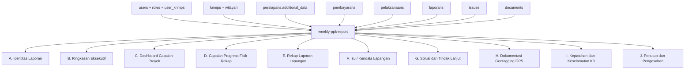

# Penjelasan Template Laporan Mingguan / Periodik PPK

Dokumen ini menjelaskan tampilan, sumber data, dan aturan perhitungan pada modal **Laporan Mingguan / Periodik PPK** di modul Laporan. Format aktif saat ini terdiri dari bagian **A sampai J** dan datanya diambil dari endpoint:

`GET /api/v1/laporan/weekly-ppk-report`

Endpoint ini wajib menghormati scoping akses:

- `super_admin`: melihat seluruh titik KNMP dan agregasi se-Sumatera.
- `admin_ppk`, `pengawas`, dan user scoped lain: hanya melihat titik KNMP yang ada pada assignment user (`user_knmps` / token `knmp_ids`).

## Ringkasan Data Flow



## Parameter Endpoint

| Parameter | Contoh | Keterangan |
| --- | --- | --- |
| `type` | `mingguan` | Mode laporan: `harian`, `mingguan`, atau `bulanan`. |
| `date` | `2026-08-24` | Dipakai untuk mode harian. |
| `start_date` | `2026-08-17` | Awal periode untuk mode mingguan/custom. |
| `end_date` | `2026-08-24` | Akhir periode untuk mode mingguan/custom. |
| `month` | `8` | Bulan laporan untuk fallback periode dan mode bulanan. |
| `year` | `2026` | Tahun anggaran/periode laporan. |

## A. Identitas Laporan

| Field Tampilan | Sumber Data | Aturan |
| --- | --- | --- |
| PPK | `users.name` dari role `ppk`, `admin_ppk`, `admin`, `wakil_ppk` | Diambil user PPK pertama sebagai penanggung jawab laporan. |
| Wilayah | `knmps.name`, `provinces.name` | Super admin menampilkan `Sumatera`; user scoped menampilkan titik/provinsi miliknya. |
| Jumlah Lokasi | Hasil query `knmps` setelah scoping | Super admin dapat melihat semua titik; admin scoped hanya titik assigned. |
| Kontraktor Pelaksana | `persiapans.additional_data->>'nama_penyedia'` atau `persiapans.nama` | Dihitung distinct untuk kontrak yang punya `knmp_id` sesuai scope. |
| Sumber Pendanaan | Konstanta domain | Default `APBN`. |
| Tahun Anggaran | Parameter `year` / tanggal akhir periode | Mengikuti periode yang dipilih. |
| Tanggal Laporan | `end_date` / `date` / akhir bulan | Menjadi cut-off laporan. |

## B. Ringkasan Eksekutif

Narasi berasal dari agregasi data bagian C, F, dan I. Jika konfigurasi DeepSeek tersedia, backend dapat membuat narasi otomatis lewat API. Jika tidak tersedia, backend memakai narasi fallback lokal berbasis capaian fisik kumulatif, persentase realisasi keuangan, jumlah status lokasi, jumlah isu aktif, dan metrik K3.

## C. Dashboard Capaian Proyek

| KPI | Sumber Data | Formula |
| --- | --- | --- |
| Capaian Fisik | `laporans.realisasi_progres_fisik` join `pelaksanaans.knmp_id` | Rata-rata progres terbaru setiap titik sampai `end_date`. |
| On Progress | Hasil klasifikasi progres per titik | Progres `> 0` dan `< 100`. |
| Selesai | Hasil klasifikasi progres per titik | Progres `>= 100`. |
| Nilai Kontrak | `persiapans.additional_data->>'nilai_kontrak'` atau `pagu_anggaran` | Dijumlahkan sesuai scope. Jika titik belum punya kontrak, fallback pagu standar `Rp 1.485.000.000 x jumlah titik`. |
| Realisasi Keuangan | `pembayarans.realisasi_anggaran` join `persiapans.id` | Dijumlahkan lewat `pembayarans.persiapan_kontrak_id = persiapans.id`. |
| Sisa Anggaran | Nilai kontrak - realisasi keuangan | Persentase dihitung dari nilai kontrak. |

Catatan perbaikan: schema saat ini tidak memiliki kolom `persiapans.nilai_kontrak`, `persiapans.perusahaan_id`, atau `pembayarans.knmp_id`. Semua query laporan mingguan harus memakai `additional_data` dan join pembayaran ke persiapan.

## D. Capaian Progress Fisik Rekap

Tabel rekap tidak lagi memakai hitungan dokumen sebagai angka utama karena dokumen dapat kosong walaupun laporan fisik sudah masuk. Angka sekarang diselaraskan dengan KPI progres:

- `Mgg Lalu`: rata-rata progres terbaru sebelum `start_date`,
- `Mgg Ini`: selisih positif antara kumulatif sekarang dan minggu lalu,
- `Kumulatif`: rata-rata progres terbaru sampai `end_date`.

Jika data detail `laporan_jenis_bangunan` tersedia, data itu dapat dipakai sebagai pengembangan per klaster. Untuk schema saat ini, sumber utama yang valid adalah `laporans` join `pelaksanaans`.

## E. Rekapitulasi Laporan Kegiatan Lapangan

Tabel ini mengambil data dari `laporans` yang join ke `pelaksanaans` dan `knmps`.

Filter wajib:

- `LOWER(laporans.jenis_laporan) = type`,
- `laporans.tanggal BETWEEN start_date AND end_date`,
- `pelaksanaans.knmp_id` harus sesuai scope user.

Migrasi `000008_fix_weekly_ppk_report_data` menormalkan data legacy/demo yang judulnya mengandung `mingguan` tetapi tersimpan sebagai `bulanan`.

## F. Isu / Kendala Lapangan

Sumber data: `issues`.

Untuk user scoped, query hanya mengambil `issues.knmp_id` yang termasuk assignment user. Tidak ada fallback ke data global. Kolom tampilan:

- deskripsi: `issues.uraian_masalah`,
- lokasi: `knmps.name`,
- penyebab: turunan dari `issues.kategori_issue`,
- risiko: turunan dari `issues.tingkat`.

## G. Solusi dan Tindak Lanjut

Sumber data utama tetap `issues`, terutama `rencana_mitigasi` yang dibentuk dari kategori isu, PIC dari `users.name` pembuat isu, target penyelesaian dari tanggal akhir periode jika belum ada field target khusus, dan status dari `issues.status`.

## H. Dokumentasi Kegiatan Lapangan

Sumber data: `documents` dengan file image (`jpg`, `jpeg`, `png`, `webp`, atau `file_type` image).

Relasi yang valid:

- dokumen laporan: `documents.documentable_type = 'laporan'` lalu `laporans.pelaksanaan_id = pelaksanaans.id`,
- dokumen pelaksanaan: `documents.documentable_type = 'pelaksanaan'` lalu `documents.documentable_id = pelaksanaans.id`,
- titik KNMP: `pelaksanaans.knmp_id = knmps.id`.

Untuk user scoped, foto hanya tampil jika `pelaksanaans.knmp_id` berada di scope user dan tanggal dokumen/laporan/pelaksanaan masuk periode.

## I. Kepatuhan dan Keselamatan K3

| Metrik | Sumber Data | Aturan |
| --- | --- | --- |
| Kecelakaan Kerja | `issues.kategori_issue` / `issues.uraian_masalah` | Hitung isu yang mengandung kata `kecelakaan`. |
| Near Miss | `issues.kategori_issue` / `issues.uraian_masalah` | Hitung isu yang mengandung kata `near miss`. |
| Pelatihan K3 | `pelaksanaans.status_k3`, `keterangan`, `kendala` | Hitung log periode yang mengandung kata `k3`. |
| Kepatuhan APD | Turunan dari isu K3 | `100%` jika tidak ada kecelakaan; `95%` jika ada kecelakaan tercatat. |

## J. Penutup dan Pengesahan

Bagian ini memakai identitas PPK dan pengawas/dinas dari tabel `users`. NIP masih bernilai `-` karena schema user saat ini belum menyediakan field NIP khusus.

## Catatan Implementasi

- Komponen frontend: `frontend/src/features/laporan/components/WeeklyPPKReportModal.tsx`.
- Agregasi backend: `backend/internal/repository/postgres/laporan_repo.go` method `GetWeeklyPPKReportData`.
- Handler endpoint: `backend/internal/handler/laporan_handler.go`.
- Migrasi data: `backend/migrations/000008_fix_weekly_ppk_report_data.up.sql`.

Validasi minimal setelah perubahan:

```bash
cd backend && go test ./...
cd frontend && npm run build
```
