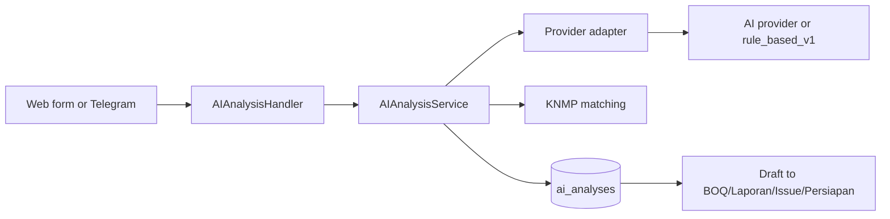

# Feature: AI Analysis

| Field | Value |
|---|---|
| Status | Implemented with optional providers |
| Frontend | `frontend/src/features/ai-analysis/` |
| API | `/api/v1/ai-analysis`, Telegram webhook |
| Owner | TBD |

## Purpose

Menganalisis teks, dokumen, foto, atau input Telegram sebagai potensi anomali dan menyiapkan draft untuk modul KNMP.

## Capabilities

- Provider `codex`, `deepseek`, `gemini`, `claude`, dan `rule_based`.
- Risk level/score, summary, findings, recommendations, extracted facts.
- Deteksi titik KNMP dan routing `target_module`.
- Auto-draft laporan, BOQ, issue, persiapan, dan pembayaran.

## Rules

Provider error atau output invalid memakai `rule_based_v1`. Dokumen tidak valid tetap disimpan sebagai item review. BOQ hasil AI berstatus `open`; `draft_input` tidak pernah menjadi approval otomatis.

## Validation and Operations

Uji provider unavailable, invalid JSON, file bukan KNMP, no matching location, duplicate webhook, secret invalid, scoping, dan soft delete. Environment: `OPENAI_API_KEY`, `DEEPSEEK_API_KEY`, `GEMINI_API_KEY`, `CLAUDE_API_KEY`, `TELEGRAM_WEBHOOK_SECRET`.

## Architecture and Flow

Flow: input file/text arrives as multipart or webhook, handler validates source, service extracts text and identifies KNMP, provider returns structured JSON, fallback runs on provider failure, result and source document are persisted, and the reviewer decides whether to copy the draft into a business module.
