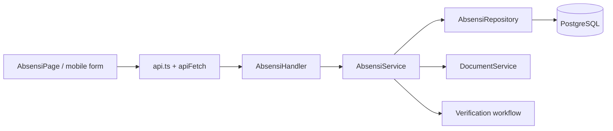

# Feature: Absensi

| Field | Value |
|---|---|
| Status | Implemented |
| Frontend | `frontend/src/features/attendance/` |
| API | `/api/v1/absensi`, `/api/v1/mobile/absensi` |
| Owner | TBD |

## Purpose

Mencatat hadir/pulang tenaga kerja pada aktivitas pelaksanaan, termasuk waktu dan koordinat GPS, lalu memproses verifikasi.

## Capabilities

- List/detail absensi dan filter periode.
- Input mobile melalui multipart endpoint.
- Upload evidence terkait attendance.
- Verify/unverify melalui alur Pengawas dan Wakil PPK.

## Data and Rules

Entity utama adalah `Absensi` dengan `pelaksanaan_id`, optional `user_id`, `tipe_absensi` (`hadir`/`pulang`), `recorded_at`, `lat`, `long`, status, dan documents. Scope mengikuti KNMP milik pelaksanaan.

## Validation and Operations

Uji missing pelaksanaan, invalid coordinate, duplicate hadir/pulang, unauthorized detail, cross-KNMP access, document ownership, dan verification transition. Lihat [RUN-002](../runbooks/RUN-002-report-and-data-integrity.md).

## Architecture and Flow

Flow: user selects `pelaksanaan_id` and tipe hadir/pulang, submits time/GPS, backend validates scope and payload, repository persists the attendance, optional evidence is stored through Documents, then verifier changes status. Report and pelaksanaan views consume the resulting record.
