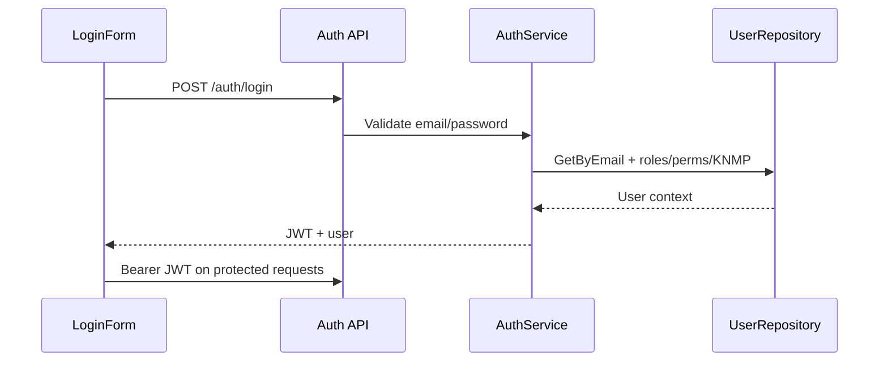

# Feature: Auth

| Field | Value |
|---|---|
| Status | Implemented |
| Frontend | `frontend/src/features/auth/` |
| API | `/api/v1/auth/login`, `/api/v1/user`, `/api/v1/auth/logout` |
| Owner | TBD |

## Purpose

Mengautentikasi pengguna dan menyediakan session context untuk route guard, permission, dan scoping.

## Flow

`email + password` -> backend validates hash -> JWT claims -> frontend stores session -> protected API requests carry Bearer token. Claims include user ID, roles, permissions, and `knmp_ids`.

## Rules

Invalid credentials return 401. Disabled/forbidden accounts must not receive operational access. Logout invalidates the client session. Frontend redirect follows role context, while backend remains the security boundary.

## Validation and Operations

Test valid login, invalid password, expired/malformed token, missing Bearer prefix, disabled account, logout, and role redirect. Never use default `JWT_SECRET` in production.

## Architecture and Flow

The frontend `AuthProvider` restores `/api/v1/user`; `apiFetch` injects the token and redirects to login after 401. Backend middleware parses claims into Fiber locals, then permission and scope middleware protect every business request.
