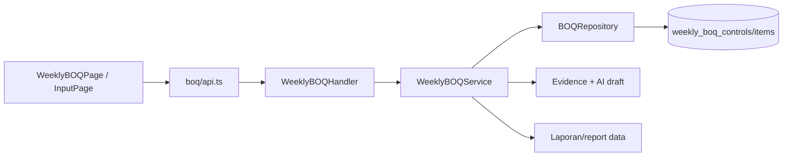

# Feature: BOQ Mingguan

| Field | Value |
|---|---|
| Status | Implemented |
| Frontend | `frontend/src/features/boq/` |
| API | `/api/v1/boq-weekly` |
| Data | `weekly_boq_controls`, `weekly_boq_items` |

## Purpose

Mengontrol perbedaan claim kontraktor, verified progress pengawas, evidence-supported progress, dan audit exposure per minggu.

## Rules

`PROGRESS = VERIFIED QUANTITY x APPROVED BOQ + VALID EVIDENCE`. Control dari AI dimulai `open`. Empty/placeholder manual rows tidak disimpan dan tidak boleh menjadi fallback report.

## Capabilities

List, stats, detail, create, update, status update, delete, item risk, evidence status, gap, dan exposure summary. Permission: `boq_read`, `boq_update`, `boq_delete`.

## Validation and Operations

Uji range percentage, week boundary, cross-KNMP, missing evidence, critical item, exposure calculation, empty manual tables, dan status update. Referensi: `docs/BOQ_WEEKLY_PROGRESS_CONTROL.md`.

## Architecture and Flow

Flow: create control for KNMP/week, enter claim and item quantities, service calculates gap/evidence/exposure, repository saves control and items, reviewer attaches evidence and updates status, then BOQ stats are consumed by dashboard/report. Empty manual rows are pruned before create/update.
