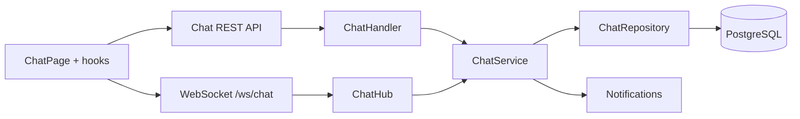

# Feature: Chat

| Field | Value |
|---|---|
| Status | Implemented |
| Frontend | `frontend/src/features/chat/` |
| API | `/api/v1/chat/*`, `/ws/chat` |
| Owner | TBD |

## Purpose

Menyediakan chat personal dan grup dengan messages, members, read marker, unread count, dan attachment.

## Capabilities

Conversation list/detail, create personal/group, list/send/delete message, mark read, member management, group update, user search, upload attachment, and WebSocket live events.

## Security

WebSocket memerlukan token. User hanya boleh membaca conversation yang diikuti. Attachment harus mengikuti ownership dan KNMP scope bila terkait project.

## Validation and Operations

Uji invalid token, non-member access, reconnect, duplicate send, unread/read state, attachment failure, proxy upgrade headers, dan message deletion. Referensi: [RUN-003](../runbooks/RUN-003-evidence-ai-and-recovery.md).

## Architecture and Flow

Flow: client loads conversations through REST, opens authenticated WebSocket, sends message to hub, service validates membership and persists it, hub broadcasts the event, and notification/unread state is updated for recipients.
