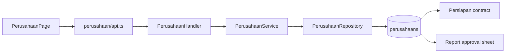

# Feature: Perusahaan

| Field | Value |
|---|---|
| Status | Implemented |
| Frontend | `frontend/src/features/companies/` |
| API | `/api/v1/perusahaan` |
| Owner | TBD |

## Purpose

Mengelola master kontraktor/perusahaan dan detail yang dipakai pada kontrak serta lembar pengesahan laporan.

## Capabilities

List/search, get by ID, lookup by name, create, update, and delete. Data yang direferensikan kontrak perlu mendapat policy delete yang jelas.

## Validation and Operations

Uji duplicate legal identity, empty name, lookup ambiguity, delete with references, unauthorized mutation, and report identity consistency.

## Architecture and Flow

Flow: admin searches or creates the legal company record, service validates identity and references, repository persists it, contract preparation links the company, and report identity/pengeshahan consumes the canonical record.
