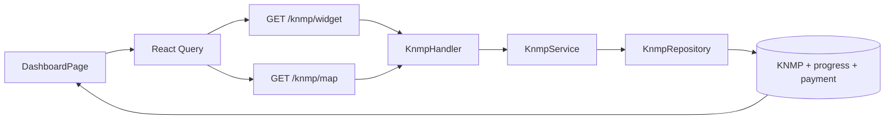

# Feature: Dashboard and GIS

| Field | Value |
|---|---|
| Status | Implemented |
| Frontend | `frontend/src/features/dashboard/` |
| API | `/api/v1/knmp/widget`, `/api/v1/knmp/map` |
| Owner | TBD |

## Purpose

Menampilkan KPI eksekutif dan peta titik KNMP berdasarkan progres fisik, anggaran, wilayah, jenis, dan status.

## Capabilities

Widget agregat, map markers, filter wilayah/status, dan detail lokasi. Global view hanya untuk user dengan policy/permission yang sesuai; kontraktor tetap restricted.

## Data and Operations

Sumber utama adalah KNMP, hierarchy wilayah, kontrak/persiapan, laporan, pembayaran, dan progres. Uji marker tanpa koordinat, filter scope, stale cache, aggregate mismatch, dan API failure.

## Architecture and Flow

Flow: authenticated management user opens dashboard, queries widget and map in parallel, backend applies global/assigned scope, aggregates KPI and coordinates, React renders cards/map/filter state, and React Query refreshes stale data without duplicating business calculations.
