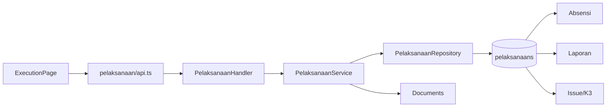

# Feature: Pelaksanaan Konstruksi

| Field | Value |
|---|---|
| Status | Implemented |
| Frontend | `frontend/src/features/execution/` |
| API | `/api/v1/pelaksanaan` |
| Owner | TBD |

## Purpose

Mencatat aktivitas/progres fisik lapangan, cuaca, tenaga kerja, kendala, dan foto geotagging sebagai sumber laporan.

## Workflow

Kontrak/baseline -> log lapangan -> evidence -> review -> laporan/BOQ. Data pelaksanaan menjadi parent untuk absensi dan sumber utama report progress.

## Validation and Operations

Uji tanggal di luar kontrak, invalid progress, missing KNMP, coordinate/photo metadata, duplicate log, update/delete scope, dan React Query invalidation.

## Architecture and Flow

Flow: field operator selects assigned KNMP and records date/activity/status K3, service validates baseline and scope, repository saves the log, evidence is uploaded against the activity, and report/absensi/issue views consume the activity ID.
