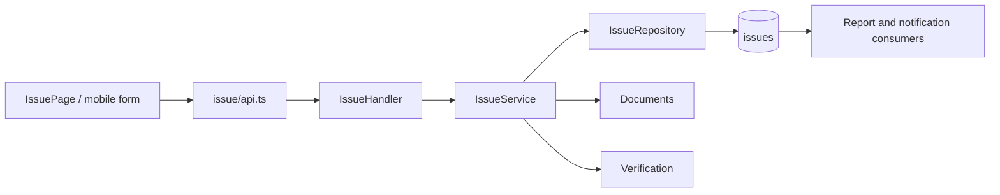

# Feature: Issue and K3

| Field | Value |
|---|---|
| Status | Implemented |
| Frontend | `frontend/src/features/issue/` |
| API | `/api/v1/issue`, `/api/v1/mobile/issue` |
| Entity | `Issue` |

## Purpose

Mencatat kendala K3, mutu, cuaca, material, dan isu lapangan beserta severity, status, evidence, mitigasi, dan verification.

## Rules

`tingkat` mencakup `ringan`, `sedang`, `kritis`, atau `lainnya`. Issue report memakai `knmp_id`, `kategori_issue`, `uraian_masalah`, status, dan documents. Critical/open issues masuk ringkasan report.

## Validation and Operations

Uji missing KNMP, invalid severity, mobile multipart, cross-KNMP, evidence upload, verify/unverify, soft delete, dan inclusion pada management summary.

## Architecture and Flow

Flow: field user submits category, severity, KNMP, and description, service validates and persists an open issue, evidence is attached, Pengawas/Wakil PPK verifies or un-verifies, and open/critical issues appear in report risk sections and notifications.
