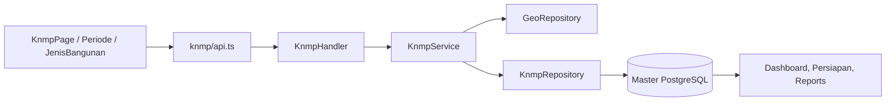

# Feature: Master KNMP

| Field | Value |
|---|---|
| Status | Implemented |
| Frontend | `frontend/src/features/knmp/` |
| API | `/api/v1/knmp`, `/api/v1/geo`, `/api/v1/periodes`, `/api/v1/jenis-bangunan` |
| Owner | TBD |

## Purpose

Mengelola titik KNMP, hierarchy regional/province/regency/district/sub-district, periode, dan katalog jenis bangunan.

## Capabilities

CRUD KNMP, cascading geographic lookup, widget/map source, periode lifecycle, jenis bangunan lifecycle, search/filter, coordinates, type `existing`/`baru`, and status.

## Security and Validation

CRUD memakai permission `knmp_*`, `periode_*`, dan `jenis_bangunan_*`. Uji duplicate master, invalid hierarchy, coordinate bounds, delete dengan dependents, and assignment scope.

## Architecture and Flow

Flow: admin selects cascading geography, enters KNMP/master values, handler validates permission and service validates relationships, repository persists the master record, then dependent features use the same IDs for assignment, reports, map, and contracts.
