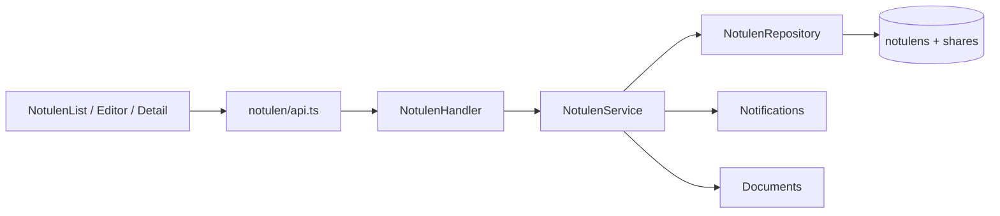

# Feature: Notulen Rapat

| Field | Value |
|---|---|
| Status | Implemented |
| Frontend | `frontend/src/features/meeting-minutes/` |
| API | `/api/v1/notulen`, `/api/v1/notulen/:id/share` |
| Owner | TBD |

## Purpose

Membuat, mengedit, membaca, menghapus, dan membagikan notulen rapat dengan agenda, peserta, keputusan, dan follow-up.

## Rules

Notulen harus memiliki konteks project/KNMP bila terkait pekerjaan. Share tidak boleh memperluas akses di luar policy. Rich text harus disanitasi sebelum render.

## Validation and Operations

Uji empty title, rich text, invalid recipient, unauthorized detail/edit/delete/share, attachment, and follow-up visibility.

## Architecture and Flow

Flow: owner creates draft, editor saves meeting content and optional evidence, service persists the document, owner shares viewer/editor access, recipients read the detail page, and published decisions become a coordination reference for project teams.
