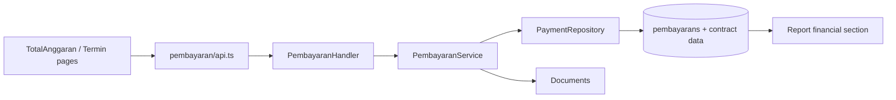

# Feature: Pembayaran

| Field | Value |
|---|---|
| Status | Implemented |
| Frontend | `frontend/src/features/payments/` |
| API | `/api/v1/pembayaran`, `/summary`, `/termin` |
| Owner | TBD |

## Purpose

Memantau pagu, realisasi anggaran, realisasi fisik, dan termin pembayaran terhadap kontrak.

## Rules

Tahapan bisnis yang terdokumentasi: uang muka/Termin I-IV dan retensi. Total realisasi harus dapat direkonsiliasi ke nilai kontrak; evidence/tagihan terkait harus authorized.

## Validation and Operations

Uji contract reference, negative/over-budget value, duplicate termin, summary mismatch, deleted rows, unauthorized access, dan report reconciliation.

## Architecture and Flow

Flow: user selects contract, enters payment category/termin and realization values, service validates against contract baseline, repository persists the transaction, evidence is attached and reviewed, then summary/termin endpoints feed report and management views.
