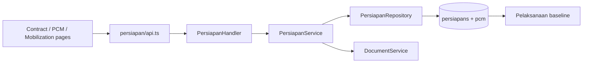

# Feature: Persiapan Proyek

| Field | Value |
|---|---|
| Status | Implemented |
| Frontend | `frontend/src/features/preparation/` |
| API | `/api/v1/persiapan`, `/api/v1/pcm` |
| Owner | TBD |

## Purpose

Menyiapkan contract readiness, dokumen kontrak/SPMK, PCM, mobilisasi alat/material/tim, dan dokumen lapangan.

## Capabilities

Persiapan kontrak/lapangan, PCM CRUD, mobilization records, upload dokumen kontrak/PCM/lapangan, document verification, and linkage to KNMP/user/company.

## Validation and Operations

Uji missing contract/KNMP, invalid dates, duplicate PCM, required document, document ownership, upload size/type, verification, and downstream report/payment visibility.

## Architecture and Flow

Flow: admin creates contract baseline, users record PCM and mobilization, service validates KNMP and dates, repository saves each record, required documents are attached/verified, and the resulting baseline becomes the parent context for pelaksanaan, laporan, and pembayaran.
