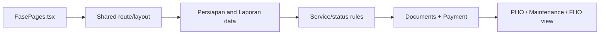

# Feature: Fase Proyek

| Field | Value |
|---|---|
| Status | Frontend phase views |
| Frontend | `frontend/src/features/project-phase/` |
| Scope | Perencanaan, PHO, Pemeliharaan, FHO |
| Owner | TBD |

## Purpose

Merepresentasikan fase lifecycle setelah baseline kontrak sampai serah terima akhir.

## Rules

PHO terkait pencapaian pekerjaan, pemeliharaan terkait masa retensi/garansi, dan FHO menandai penyelesaian akhir. Transisi harus konsisten dengan laporan, pembayaran, dokumen, dan approval.

## Validation and Operations

Uji akses per role, fase tanpa kontrak, tanggal invalid, status tidak berurutan, dokumen pendukung hilang, dan kesesuaian dengan laporan/payment. Detail API fase bila tersedia perlu ditambahkan ke katalog saat route backend ditetapkan.

## Architecture and Flow

Flow: contract baseline and verified progress establish the lifecycle state, operators attach supporting documents, the phase page presents the current state, and completion is reflected back into reports and payment controls. The repository currently exposes phase views without a dedicated phase API route, so backend persistence is a documented gap.
