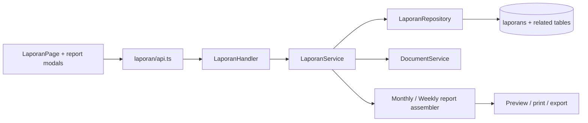

# Feature: Laporan Proyek Terpadu

| Field | Value |
|---|---|
| Status | Implemented |
| Frontend | `frontend/src/features/reports/` |
| API | `/api/v1/laporan`, monthly/weekly report endpoints, mobile input |
| Owner | TBD |

## Purpose

Menghasilkan laporan harian, mingguan, bulanan, report PPK, dan dokumen terpadu 14 bagian dengan preview/cetak.

## Sections and Sources

Contract identity, highlight, time/progress, S-curve, milestones, quality, K3, material, document tracker, issues, payments, two-week look-ahead, management summary, and approval sheet. Sources include KNMP, persiapan, pelaksanaan, documents, BOQ, issues, absensi, and pembayaran.

## Rules

Verify flow: Pengawas -> Wakil PPK -> verified. Empty/placeholder rows are excluded before save and render. Print modes include A4/A3 and portrait/landscape; report output must preserve source lineage.

## Validation and Operations

Uji period query, missing source, stale cache, 0/100 progress, report verification, document preview, mobile multipart, print overflow, and cross-KNMP access. Referensi: `docs/REPORT_DATA_DICTIONARY_V1_V2.md`.

## Architecture and Flow

Flow: user selects period and KNMP, service loads source domains, calculates progress/time/finance and assembles report sections, UI previews the result, user submits or edits permitted narrative, verification advances through Pengawas and Wakil PPK, and the final report is used by dashboard/payment/management.
