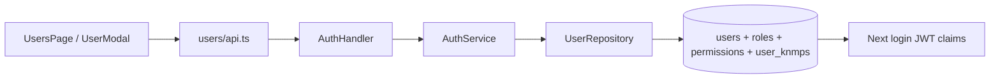

# Feature: User Management

| Field | Value |
|---|---|
| Status | Implemented |
| Frontend | `frontend/src/features/users/` |
| API | `/api/v1/users`, `/roles`, `/permissions` |
| Owner | TBD |

## Purpose

Mengelola akun, role, permission, dan assignment titik KNMP untuk seluruh aktor platform.

## Capabilities

List/search/pagination, create, update, delete, role lookup, permission lookup, and multi-select `knmp_ids` assignment.

## Security and Validation

Only permitted administrators may mutate users. Test duplicate email, password handling, role change, empty assignment, assignment removal, self-delete policy, and immediate scope effect after token refresh.

## Architecture and Flow

Flow: administrator selects role and KNMP assignments, handler checks permission, service hashes password and applies assignments, repository updates relational links, and the user's next login receives the new roles/permissions/`knmp_ids` in JWT claims.
